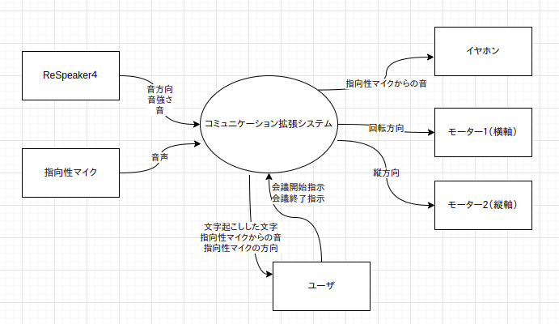
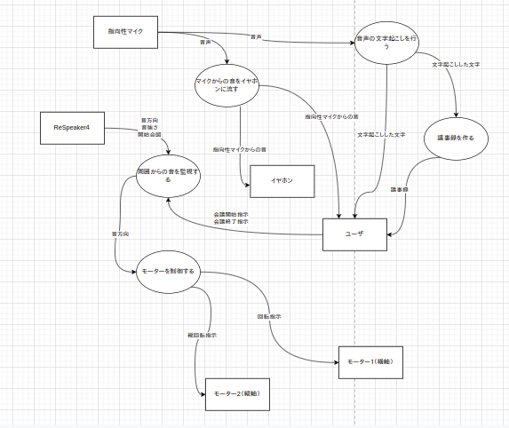

# コミュニケーション拡張システム
## できること
- リアルなコミュニケーションにおいて場の情報を最適にユーザーへ伝えること
    - 周囲の余分な音をカットし必要な情報を届ける
    - コミュニケーションの内容を書き起こす
    - コミュニケーションの内容を総括する
## イベントリスト
|No.|スティミュラス|アクション|レスポンス|エフェクト|
|----|----|----|----|----|
|1|コミュニケーションを始めたい|会議開始（キー入力)|文字起こし、音検知を始める、イヤホンにマイク（単一）からの音を流す|作動(UI)|システムが起動する、イヤホンから音が流れ始める|
|2|声を出している人が見つかる|大きな音を検知する|マイクをその方向に向け、STTを開始する・ユーザーの名前をつける|喋っている人の声が聞こえる、文字起こしがみえる・ユーザーの名前がみえる|
|3|別の声を出している人が別の方向で見つかる|別の方向から声を検知する|一番大きい声の人にマイクを向ける、新たにユーザーの名前をつける|一番大きい声の人の声が聞こえる、文字起こしがみえる・ユーザーの名前がみえる|
|4|会議が終わる(キー入力)|文字おこし、音検知をやめる、マイク（単一）への音を流すのをやめる|議事録が表示される|議事録が読める|

## コンテキスト図
  
- https://app.diagrams.net/#G1u4P6laaxGUMf6MBjp7q2eMRGZb4mqWu4

## データ辞書
会議開始指示 = "MeetingStart”の声
会議終了指示 = "MeetingEnded”の声
音方向 = 一番音が大きい方向(0~360deg)
音強さ = 音の大きさ(デジベル)
回転指示 = *モーターを指定角度に回転させる制御*
縦回転指示 = *モーターを縦方向に回転させる制御*
議事録　＝ 会議開始日時＋発言＋会議終了日時
文字起こしした文字　＝　会議中の一番最近の発言テキスト

## DFD0
  
