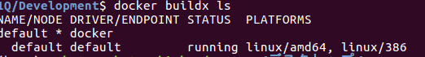

# 221Qテーマ
1. ある方向の音声を増強し、それ以外の方向の音声を減衰させることによって、耳の認識を補助するデバイスの開発
2. 1Qで培ったSSTの技術やdlibでの顔認識技術を使って、音声のライフログを取る、人類ギャルゲー化計画

# ある方向の音声を増強し、それ以外の方向の音声を減衰させることによって、耳の認識を補助するデバイスの開発
## 具体的調査項目
- Respeakerを用いた音源音源定位のプロトタイプ作成
- Respeakerもしくは回転する指向性マイク等を使った
特定の方向の音声を取ってくるシステムの開発
## 調査
ライブラリについて
    - 全部apt-getでとってこれそう
    - コンテナ開発できそう
- こちらのHPを参考にDockerfileを作ってみる
    - https://blog.tkrel.com/6307
## Rasberry pi用イメージをUbuntu上で作成する
- ラズパイのCPUはアーキテクチャーがARMなのでx_86とは違うCPUアーキテクチャーである。なので普通のPC用のDockerイメージとラズパイのDockerイメージに互換性がない。
- そこでARM用DockerイメージをビルドするためにDockerのbuildx機能を使用する

- Dockerfileがあるディレクトリでbuildx機能を使ってRasberry pi用イメージをビルドする
```
docker buildx build --platform linux/arm/v7 .
```
- 下記エラーが出てビルドが止まってしまった
```
standard_init_linux.go:228: exec user process caused: exec format error
```
- 調べたところ、Dockerfile(Rasberrypi用)でビルドするイメージとビルドした私のPC(Ubuntu)でCPUアーキテクチャが違うため発生するらしい
- docker builds lsで対応プラットフォームを確認
  
- arm/v7がない... 試しにamd64でビルドしてみると通った
- デフォルトのビルダーの中にはarm/v7が入っていないことが原因の様子
- 新しいビルダーを作ってみる
```
$ docker buildx create --name mybuilder
```

## 参考資料
- ReSpeaker4 wiki
    - https://wiki.seeedstudio.com/ReSpeaker_4_Mic_Array_for_Raspberry_Pi/

- Rasberry pi zeroとRespeakerデモ
    - https://blog.tkrel.com/6307
- Rasberry pi上にDockerを構築する
    - https://qiita.com/k_ken/items/0f2d6af2618618982723

# 1Qで培ったSSTの技術やdlibでの顔認識技術を使って、音声のライフログを取る、人類ギャルゲー化計画
## 作業項目
- 声紋認識技術のプロトタイプ作成
- 画像からの人物特定技術のプロトタイプ作成
## 調査
### 声紋認識技術の調査
- OSSの音声認識エンジンJuliusを使った母音のクラスタリング
    - https://qiita.com/k-maru/items/4f12fd0f8344b9e093bd
- 人の声のフォルマントを特徴量として取ってきて、その特徴量によって誰が喋ったかを分類する？
    - だが、個人が特定できるレベルの普遍的なフォルマントの特徴量とかあるのか？
    - 上の例でもあるように、分類するのにDeeplearningを必要としそう
- 話者認識についての首都大の授業スライド
    - https://www.sp.ipc.i.u-tokyo.ac.jp/~saruwatari/SP-Grad2016_06.pdf
    - 話者認識とはSpeaker Verigficationという分野らしい
    - 話者を特定する普遍的なパラメータとしてMFCCというものがあるらしい
- SVMとLPC分析でPythonによるSpeaker Verification
    - https://heartstat.net/2021/05/12/python_sr_lpc_svm/
- PaizaにPython×機械学習の講座があり、この中で声優の話者認識をしている
    - https://paiza.jp/works/ai_ml/primer
- 会議の効率的な振り返りを支援する話者クラスタリング技術
    - https://www.global.toshiba/content/dam/toshiba/migration/corp/techReviewAssets/tech/review/2015/04/70_04pdf/f01.pdf
### やってみること
- まずはPaizaの講座を受けてみる
### Paiza講習メモ
- とりあえずPythonで機械学習するためにJupyterNotebookというのを入れたほうが良いらしい
#### jupyter note-bookとは
- Pythonの実行環境、VS-codeと同じようなIDEのひとつ
- 対話型でブロックごとに実行できるのが良いらしい

- と思ってJupyter-notebookを入れようと試みたが
    - そもそもpipのversionが古いらしい
    - pip入れなおすかーと思ってget-pip.pyを実行しようと思ったらPython３のVersionが古いらしい
    - ということでPython3のヴァージョンアップをしてからpip3の最新バージョンを入れなおし、Jupyter-notebookをインストールする
#### python3.5から3.9.2へのアップグレード
- https://self-development.info/ubuntu%e3%81%ab%e6%9c%80%e6%96%b0%e3%83%90%e3%83%bc%e3%82%b8%e3%83%a7%e3%83%b3%e3%81%aepython%e3%82%92%e3%82%a4%e3%83%b3%e3%82%b9%e3%83%88%e3%83%bc%e3%83%ab%e3%81%99%e3%82%8b/

#### pip3自体のインストール
- https://qiita.com/HiroRittsu/items/e58063fb74d799d37cc4

#### Jupyter-notebookのインストール
```
sudo pip3 install notebook
```
#### Anacondaのインストール
- しかしここまでだとnumpyやLibrosaなど機械学習のライブラリが入ってないため、個別に入れなければいけない
- そういうのを一括にいれてくれるのがAnacondaらしい
- ちなみにJupyter-notebookも入れてくれるってさ!!
- すわなち最初からAnacondaいれときゃよかったんや!!!!
- インストール方法は以下
    - https://qiita.com/m0p1nt/items/b55b175c78ecfa42eeea

#### VSCodeでの環境をAnacondaでの仮想環境に切り替える
- さーて、Anacondaも入れたことだし、numpyやら使ってスクリプト実行してやるぜ！と思ったところ、numpyなんてねーよ！と言われてしまう
  

- どうやらVSCodeでのPythonの実行環境をAnacondaでの仮想環境に切り替えてあげなきゃいけないらしい
    - こちらのURLを参考に切り替えた
    - https://qiita.com/kusanoiskuzuno/items/dabed9c2f538bc6744cf

#### jupyter-notebookでOpenCVが入らない！
- Anacondaの仮想環境下でOpenCVを入れたはずなのにJupyter-notebookで”import cv2"するとエラーで弾かれる
- どうやら元々入っていたROS環境と鑑賞しているらしい
- Anacondaで仮想環境を切り替えれば自動的にJupyter-notebookの使用環境も切り替わるのかなと思っていたが、Jupyter-notebook側でも環境の切り替えが必要らしい
- jupyternotebookを仮想環境に切り替える
    - https://www.servernote.net/article.cgi?id=anaconda-jupyter-notebook-on-myenv
- 環境構築マジ大変

#### anaconda経由で機械学習やデータ入出力のライブラリを入れる
- まず仮想環境を切り替える(今回は予め作ったpy39という仮想環境)
```
conda activate py39
```
- ライブラリをインストールする（Scikitlearnの場合）
```
conda install scikit-learn
```
#### Dockerで全ての環境設定をスキップする
- Anacondaを全てのPCに入れて環境構築するのはまぁまぁめんどい（特に今回はラズパイ上でも行わなければならない）
- Dockerを使えば

#### paiza話者認識メモ
- 機械学習で声優の声を識別する
    - 教師データ（音声）で学習し、テストデータの話者を予測する
- 音声データを扱うライブラリ：LibROSAを使う
- パターン認識モデルはSVM
    - 教師データに境界を作り、テストデータがどちらに属するか判定する
    - 境界付近のデータを竿イートベクトル、境界線までの距離をマージンという
- 声をフーリエ変換してMFCCという音声の特徴量を取りだす


### 画像からの人物特定技術の調査
- OpenCVで顔を特定して追従まではできそうだけど、元々の顔写真を登録しておく必要がありそうだなぁ。これは声紋も一緒か？
    - https://qiita.com/Hironsan/items/8ad9b11bcc0c618ec5e2
