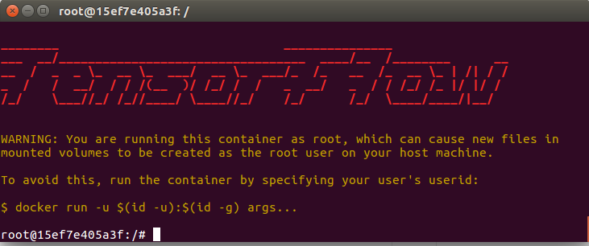
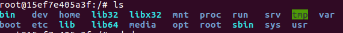
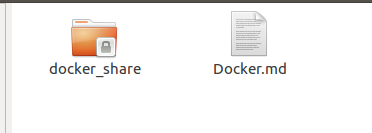
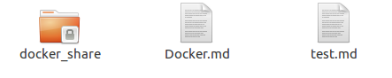
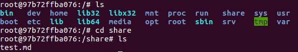
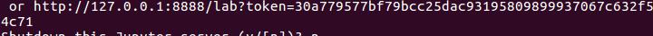
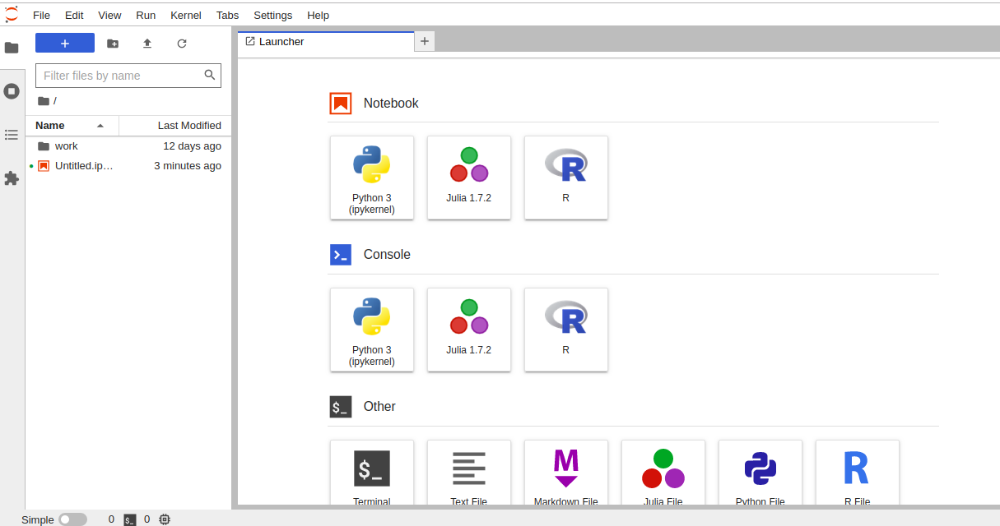
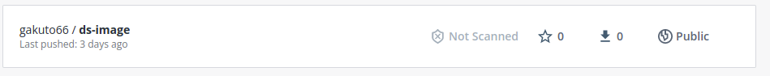

# このドキュメントについて
- 機械学習やDeeplearningの環境設定にめちゃくちゃ時間がかかった（いい経験にはなったが）のと、これからラズパイなどに同じ環境を作っていくのに、もう一度これを繰り返すのはしんどいので、Dockerについて学び、環境設定を秒で終わらせられるようにする
# Dockerとは
- Docker社が開発するコンテナのアプリケーション実行環境を管理するOSS
    - コンテナ：実行環境を他のプロセスから隔離し、その中でアプリケーションを動作させる技術
    - コンテナに構築されたアプリは独立したコンピュータでアプリが動作しているようにみえる
- コンテナを用いることで異なるサーバーでも同じ構成の環境を簡単に構築することができる！
    - 基本LinuxなのでLinuxでWindows環境を作る環境構築はできない
    - Docker for Windowsを使ってLinux環境をWindowsに構築することはできる
- Dockerはコンテナに含まれるアプリケーションをパッケージ化して実行する機能と、コンテナを管理するためのツールとプラットフォームを備えている

# コンテナと仮想マシンの違い
- 既存の仮想環境としてはPCのハードウェア全体を仮想化して、その中でOSやアプリを動作させる仮想実行環境がある
    - ハイパーバイザ型（Hyper - V)やホスト型（VMWarePlayer,VirtualBox）等
- この方式では関係のないサービスも多数どう察することによってオーバーヘッドが大きく、リソースも無駄になる
- それに対してコンテナはLinuxカーネルが持つ「コンテナ」機能を使って実行環境を隔離し、その中でアプリケーションを動作させる
- コンテナはそれ以外のLinuxの通常プロセスとほぼ同じものだが、利用できる名前空間やリソースが他のプロセスやコンテナから隔離され、固有の設定を持てるようになっている
- よってコンテナ内のアプリケーションから見ると、独立したコンピュータ上で動作しているように振る舞う。
- コンテナを管理するプロセスは通常のプロセスを管理するコストとほとんど変わらず、仮想マシンを管理するコストと比較して非常に軽い！
# コンテナの機能
## 名前空間の隔離機能
- ファイルシステム、PC名、ユーザー名、グループ名、プロセスID、ネットワーク機能をコンテナ毎に独自に設定できる機能
## リソースの隔離機能
- CPUやメモリ、ディスク入出力など、コンテナ内で利用するリソースを他のコンテナから隔離したり設定に基づいて振り分ける機能
- Dockerでは最終的なアプリケーションをホストOS上の1つのプロセスとして実行される
  
- それに対してハイパーバイザー型やホスト型の仮想実行環境では仮想化されたハードウェア上でLinuxOSが動作し、その上でアプリケーションのプロセスが動作している。アプリケーションを実行するためにゲストOSを稼働しなければならないので起動に時間もかかるし、CPUやメモリ、ディスクなどもリソースを多く消費する。
  

# Dockerイメージとは
- アプリケーションとその実行環境、展開・操作方法などをまとめてひとつのパッケージにしたもの。
- Dockerfileを使うとイメージに対して適用する指示を記述できる。（Ruby,MySQLのパッケージを追加し、Appコマンドを実行する等）

# Dockerイメージの履歴管理
- Dockerのコンテナ中ではファイルシステムは全て書込み禁止となっていて、書き込まれた内容は全て「レイヤー」に保存される。更新された差分データのみを別ファイルとして取り扱うのでGitのようにすぐに以前のイメージに戻したり、新しく派生の環境を作ったりできる

# Dockerを使ってみる(Ubuntu)
## Docker本体のインストール
- 本家DockerのリポジトリからDLしてきてインストールする

```
$ sudo apt-get install apt-transport-https ca-certificates curl software-properties-common
$ curl -fsSL https://download.docker.com/linux/ubuntu/gpg | sudo apt-key add -
$ sudo add-apt-repository "deb [arch=amd64] https://download.docker.com/linux/ubuntu $(lsb_release -cs) stable"
$ sudo apt-get update
$ sudo apt-get install docker-ce
```
## ユーザアカウント作成
- ユーザーを有効にするのに最ログインが必要なので一度シェルを再起動します
```
$ sudo gpasswd -a [ユーザ名] docker
$ exit
```
## Dockerの動作確認
- バージョン確認する
```
$ docker --version
Docker version 20.10.7, build f0df350
```
- 下記コマンドで動作確認する。Hello from Docker!~のメッセージが現れたら成功
```
$ docker run --rm hello-world
```
## Docker Composeをインストールする
- Docker composeとは複数のコンテナで構成されるアプリケーションについてDockerイメージのビルドや各コンテナの起動・停止などをより簡単に行えるようになるツール
- 下記コマンドを実行する
```
$ mkdir -p ~/.docker/cli-plugins/
$ curl -SL https://github.com/docker/compose/releases/download/v2.5.0/docker-compose-linux-x86_64 -o ~/.docker/cli-plugins/docker-compose
$ chmod +x ~/.docker/cli-plugins/docker-compose
```
- バージョン確認
```
$ docker compose version
Docker Compose version v2.5.0
```
## Dockerの開発手順
- 「docker images」コマンドで利用できるイメージを確認する
- イメージが足りていなかったら「docker search」「docker pull」コマンドでDockerレジストリから必要なイメージを入手したり、Dockerfileというスクリプトファイルと「docker build」コマンドで新しいイメージを作成する
- dockerイメージが用意出来たら「docker run」コマンドで起動し、「docker ps」コマンドで実行中のコンテナを確認する
- Dockerのコンテナは独立したネットワークを持つプロセスとして起動するので、外部と通信する場合は[docker port]コマンドでネットワークの設定を行う。
- [docker commit]コマンドで新しいイメージとして保存することができる。
- 残っているディスクイメージを完全削除したい場合は[docker rm]コマンドで削除できる
- Docker imageそのものを削除したい場合は[docker rmi]コマンドを実行する

# Dockerで機械学習環境を構築してみる！
## 機械学習において、Dockerを使うメリット
- ローカルマシンで構築した環境をサーバー上のマシンで一瞬で構築できる
- 今ある環境を壊さずに使い捨てのテスト環境を一瞬で構築・破壊できる
- 環境まるごとイメージ化できるので問題の出やすいバージョン依存関係エラーが起きない
- DockerHubという公開ファイルサーバーに無料で大きいイメージファイルをバックアップできる
- 便利な環境が揃ったDockerイメージが豊富にある

## Tensorflow環境を作ってみる
- 下記コマンドを実行してDockerイメージを落としてくる
```
docker pull tensorflow/tensorflow
```
- 下記コマンドでTensor flowのイメージがあることを確認
```
docker images
```
  

- 下記コマンドでTensor flowのイメージを立ち上げてみる
```
docker run -it --rm --name tensorflow tensorflow/tensorflow
```
- そうするとTensor flowのイメージが立ち上がる
  

- lsコマンドでファイル構造を見てみよう！
  

- この環境はDockerイメージ固有の環境であるため、何をしようとコンテナを破棄して、また立ち上げれば全て元通りとなる！

- exit か　Ctrl + Dでシェルを終了する

## ホストとファイル共有を行う
- ホストPCと共有フォルダを設定することによってファイル共有を行うことができる。ホスト側で作ったプログラムをDocker側で動かす時などに使う。
- 下記コマンドを入力する
```
docker run -it -v $PWD/docker_share:/share --rm --name tensorflow tensorflow/tensorflow

```
- -vというオプションを使って-v host directory:[container directory] と指定することで、ホスト側とコンテナ側のディレクトリを共有できる

- 上記コマンドを入力すると実行したディレクトリ以下に下記のようにdocker_shareフォルダが作られる
  

- このdocker_shareフォルダの中に試しにtest.md をコピーしてみる（管理者権限が必要）
  

- Dockerイメージを立ち上げているシェルでshareフォルダを覗いてみると確かにtest.mdが存在する
  

- この仕組みを使ってコンテナ内とホストPCでファイルのやり取りができる

## ホストからコンテナ内で立ち上げたJupyternotebookにアクセスしてみる
- Jupyter notebook環境を下記コマンドでPullして同時に立ち上げる
```
$ docker run -p 8888:8888 -it --rm --name ds jupyter/datascience-notebook
```
- http://localhost:8888にアクセス
- 出てきた画面にシェルに表示されているTokenを入力する
  

- Jupyter notebookが立ち上がる。一瞬で環境構築終わった。はええええええええええ
  


## Dockerイメージの保存
- Dockerイメージの保存は下記3通り
    - コンテナからイメージを作成する
    - Dockerfileからイメージを作成する
    - GitHubとDockerHubを連携させてイメージ作成する

### コンテナからイメージを作成する
- 下記コマンドで起動しているコンテナを新たなイメージとして保存できる
```
docker commit ds gakuto66/ds-image
```
- dsの部分はコンテナ名 gakuto66はユーザーネーム ds-imageはリポジトリ名である

- イメージ名はDocker Hubで公開したい場合はイメージ名を
<Docker Hub ユーザ名>/<リポジトリ名>　とする必要が在る

- 保存したイメージは下記コマンドで実行できる
```
docker run -it --rm --name ds gakuto66/ds-image
```
## dockerfileからコンテナを作成する
- ここは深そうなので省略

## 作成したDocker imageをHUBにアップロードする
- Docker hubにログインする
```
docker login
```
- 作ったイメージをPushする
```
docker push gakuto66/ds-image
```
- docker hubを見ると確かにイメージがPushされている
  

# 耳身体能力拡張のプロトタイプをDockerイメージにしてDockerHubにブチ上げてみる

- あらゆるPythonライブラリを2つのパソコンに入れなきゃいけなくてクソ時間を浪費していた今まで
- そんな無駄な時間もおさらば！Dockerイメージにライブラリごとブチ込んでDockerHubに打ち上げてやりゃあどんPCでも環境構築は一瞬さ！ということでやってみよう

## Docker fileを書く


##　参考記事
- https://atmarkit.itmedia.co.jp/ait/articles/1701/31/news043.html
- https://knowledge.sakura.ad.jp/16862/
- bash シェルスクリプトとは
    - https://shellscript.sunone.me/tutorial.html
- からあげさんのDocker使って機械学習入門
 - https://karaage.hatenadiary.jp/entry/2019/05/17/073000
 - さくらナレッジさん
    - https://knowledge.sakura.ad.jp/15253/