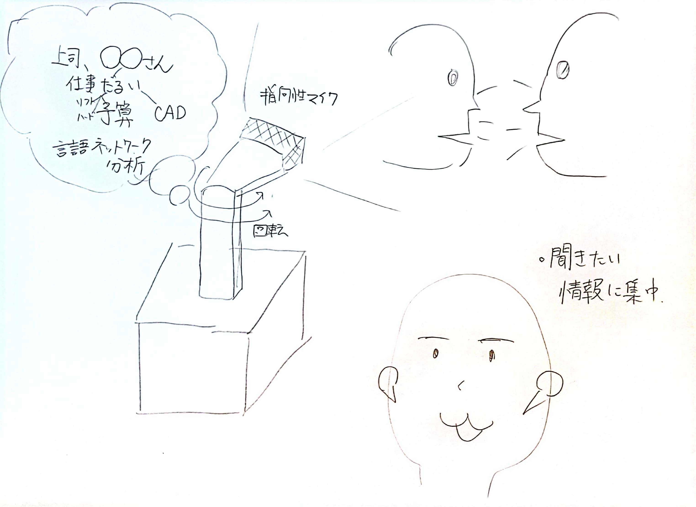
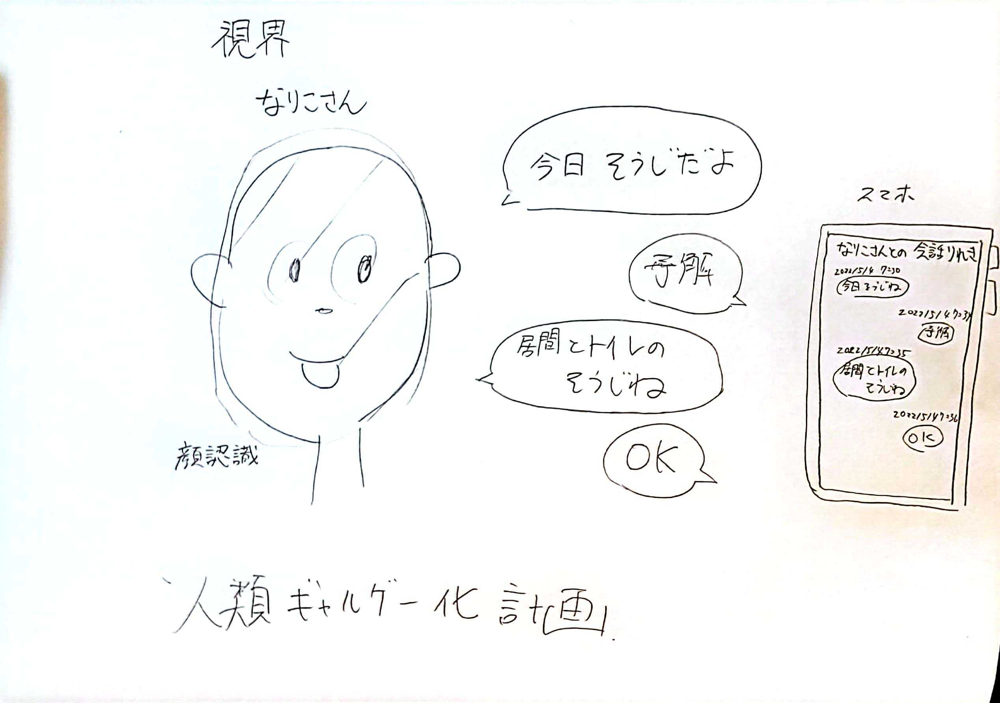

# 概要
221QのHumanAugmentedテーマで何をやるか決める
# 214Qの反省
## やったこと
- 聞きたいものが大きく聞こえる耳、聞きたくないものが聞こえない耳のプロトタイプ作成
- フォルマント変換を用いた聞きたい声で聞こえる耳のプロトタイプ作成
## 反省
### 聞きたいものが聞こえる耳、聞きたくないものが聞こえない耳
- 聞きたくないものを聞かない、はできているが、聞きたくない部分だけ聞かないということができない（全てが聞こえなくなってしまう）
- 聞きたいものを聞くという場合、単純にゲインを大きくしてしまうとかなり不快に感じる。
- 音声認識機能について
    - 会話や音がずっと流れている場合に会話の途切れが見つからずテキスト化されない
    - 検閲ワードを検出した瞬間は検閲できない
### デモを通してもらったアイデア・思いついたアイデア
- 喋れない（聞こえない）情報があった状態でコミュニケーションを行っても、当人たちも全く気付かないままコミュニケーションを続けられるとしたら面白い？
- カクテルパーティー効果みたいなのを減少させて、前の人の情報に集中するデバイス(SSB)
- 誰かが呼んだ時にだけ外界の情報を聞くようにしたら便利そう（みやさん）
- 声紋特定ができれば検閲ワードに引っかかりやすい人間、すなわち良い情報を持っている人間、NGワードを発しやすい人間などを特定できるかも(SSB)←これ面白そう（なりちゃん）
    - 声紋特定が厳しかったら、視覚情報から顔認証を行い、音の定位特定で会話をその人に紐付けるみたいなことできそう！！！！（SSB）
- どういう頻度でどういう単語が出るのか？わかるだけでもその人の色々な情報がみえるのではないか？（天野さん）
- ユーザの位置情報と組み合わせれば、検閲ワード検索によて、場のコミュニケーションを可視化し、そこが自分にとって生きやすいコミュニティか、生きづらいコミュニティか評価できるかも？（佐々部）
- 目の前の人物の特定と、SSTによる会話情報のバックアップを組み合わせられれば、その人がどういうことを喋る人間か？自分とどんなことを喋った人間かログが取れるかも
    - リアルなコミュニケーションをギャルゲー化できる
        - 喋ったことのログを取る
        - ログからその人がどんなことに興味がある人間かわかる
        - 会話中にこんなことを話したら？みたいなレコメンドがかかる
### 214Qまとめ
- 214Qでは素朴なレベルでの耳拡張・耳減衰を行った。そこから単純なゲインの増強では不快感があるし、NGワード検閲による耳感覚減少では、全ての音声をシャットアウトしてしまうためコミュニケーションが困難になってしまうことがわかった。
- それを踏まえて221Qでは、聞きたい情報が発せられる特定の方向に耳を集中させ、聞きたくない情報がある方向の聴覚情報は減衰させるというアプローチをとる
- 一方で音源の方向が推定できれば、ある音源に集中して音を収集するということが可能なはずである。そこから声紋推定ができればその人物がどのような情報を持っているか判別することも可能であると思われる。よって声紋推定についても調べてみる
- また人物特定（OpenCV＋Dlib）と合わせて、この人が何こんなことを言っていたということを音声＋顔で認識できたらとてもいい
- これができれば騒音環境の中で話を聞きたい人物に耳を集中することができるなどの活用方法があると思われる
# 221Qでやりたいこと
## 先行研究
- デジタル補聴器
    - https://www.widexjp.co.jp/ha_choice/about/degital_ha.html
    - https://www.widex.com/ja-jp/local/ja-jp/evoke-ai
- これらによるとデジタル補聴器では
    - 定常雑音を下げる機能
    - 変化している音を低減する機能
    - 前方の音を増強する機能
    - 衝撃音を低減する機能
    - 場面に合わせて声だけを強調する機能
    などがあるらしい。知らんかった〜普通にほしい
## 先行研究を踏まえて今何がやりたい（ほしいか？）
### 1. 耳認識の拡張
- 話しかけられた時や危険が迫った時は反応できるが、それ以外では誰にも邪魔されない静かな環境がほしい
- 特定の会話だけに気付かれずに耳を傾けたい（前方だけでなく必要な情報にだけ聞き耳をたてたい）
### 2.耳情報のログ蓄積
- その人とどんなことを喋ったか？自分がその場にいなくてもその人がどんなことを喋っていたかわかるログがほしい。
- その人と喋ったことを全てログに取れれば、「こう言ったはず」「いや聞いてない」みたいなコミュニケーションの不一致を是正できるはず。
## 決定テーマ
1. 自分に関連する会話や気になる会話がある方向の音声を増強し、それ以外の方向の音声を減衰させることによって、耳の認識を補助するデバイスの開発
  

2. 1Qで培ったSSTの技術やdlibでの顔認識技術を使って、音声と人物を一致させ、音声のライフログを取るデバイス（人類ギャルゲー化計画）
  
## もらったフィードバック(5/7)
- 相手も同じデバイスを持ってる？
    - スマホ？みたいにみんながマイクとGPSを持ってて、そこから誰と誰がコミュニケーションしたかわかる（近い位置にいる人間をGPSで特定して、その時に声を収集するデバイス？）
    - 相手を特定するだけならカメラいらなくてもいい？
- 人類ギャルゲー化計画の方が受けがよさそう

## 221Qでやること
- 音源推定
    - 人が喋っている方向を特定する
        - Respeakerを使った音源推定
    - 喋っている声に集中する 
        - Respeakerを用いたデジタルな音源指向性処理の調査
- 声紋推定
    - 声から特徴量を抽出して声を特定する可能性調査
- デモ
    - ラズパイで音源定位を行い、声紋特定し、人物とセットで発話内容を可視化する
## 222Qでやること
- 画像認識との組み合わせによる感情推定
- 発話内容のクラスタリングやコミュニケーション分析
## 具体的な調査事項
- Respeakerを用いた音源音源定位の調査
- Respeakerもしくは回転する指向性マイク等を使った特定の方向の音声を取ってくる技術の調査
- 声紋認識技術の調査
- 画像からの人物特定技術の調査