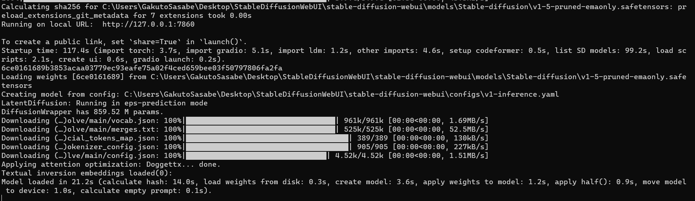
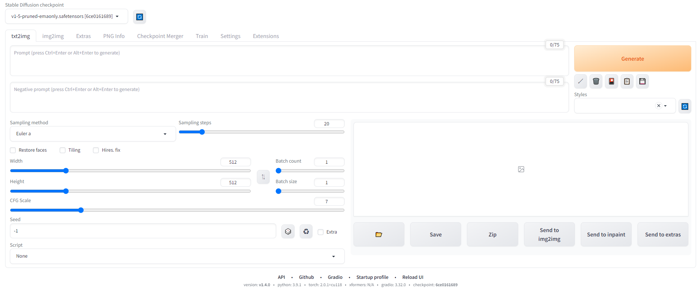

# ControlNetを使って,リアルタイム美少女画像を生成する

# pythonの自作プログラムからStableDiffusionWebUIを使う
- ローカルで実行しているStableDiffusionWebUIをWebAPIを通して自作のPythonプログラムから叩く方法を説明する

## Stable Diffusion WebUIのセットアップ
- 任意のフォルダで下記コマンドを実行し，StableDiffusionWebUIをDLしてくる
```
git clone https://github.com/AUTOMATIC1111/stable-diffusion-webui.git

```
- 下記コマンドでwebuiを起動するbatファイルを実行す
```
cd stable-diffusion-webui
.\webui-user.bat
```
- コマンドプロンプトにしたのような表記が出たら問題なくWebUIの立ち上げが完了

- ブラウザからhttp://127.0.0.1:7860にアクセス


## WebAPI機能を有効化する
- WebAPI機能を有効にするとPython等のプログラムからStableDiffusionを実行できる
-WebAPI機能を有効にするにはwebui-user.batをメモ帳等で開き,6行目に--apiを追加する
```
@echo off

set PYTHON=
set GIT=
set VENV_DIR=
set COMMANDLINE_ARGS=--api

call webui.bat
```
- 上記の変更が完了したらStaebleDiffusionWebUIを再起動する
## sdwebuiapiをインストールする
- Stable Diffusion WebAPIのAPI呼び出しを簡単にするラッパーライブラリのsdwebuiapiを使うと簡単にPythonからSDを呼び出せる
- 下記コマンドをコマンドプロンプトで実行する
```
pip install webuiapi
```
## 画像生成を行うpythonの自作プログラムを書く
- 次にStableDiffusionをPythonで実行するプログラムを書く

```python
import webuiapi
# APIのインスタンスを作成 ############################
api = webuiapi.WebUIApi()
# プロンプトを宣言 ##################################
PROMPT= "masterpiece, best quality, shinkai makoto, boy"
# 画像を生成する
result1 = api.txt2img(prompt=PROMPT)
# 画像を保存する
result1.image.save("testsd.png")
```
- 上記のプログラムをVSCode上で作成し，実行するとカレントディレクトリにtestsd.pngというファイルで生成されたイラストが確認できる

# ローカルネットワーク上の他のPC上にある自作PythonプログラムからStableDiffusionWebUIにアクセスする

## StableDiffusionWebUIをサーバー化する設定を行う
- webui-user.batをメモ帳等で開き,6行目に--listenを追加する

```
@echo off

set PYTHON=
set GIT=
set VENV_DIR=
set COMMANDLINE_ARGS=--api--listen

call webui.bat

```
## PCの7860番ポートを解放する
- 下記URLを参考
    - https://zenn.dev/garyuten/articles/229c126405de37
# 参考
- https://knowledge.sakura.ad.jp/35226/
- https://zenn.dev/garyuten/articles/229c126405de37

# StableDiffusionで透過pngを作る
- https://e-penguiner.com/stable-diffusion-rembg/
- https://github.com/danielgatis/rembg

# LoRAが公開されているサイト
- https://civitai.com/articles