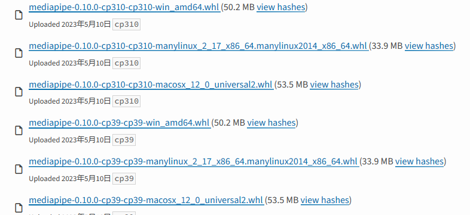

# ラズパイでMediapipeを動作させる
## ラズパイの環境設定
- https://zenn.dev/karaage0703/articles/63fed2a261096d
- Raspberry pi Imagerを使ってSDカードにRaspberry pi OS(64bit版)をインストールする
- 下記コマンドで日本語入力を設定
```
sudo apt update
sudo apt install ibus-mozc

```
## Mediapipeのインストール(Raspberry Pi4編)
- 下記コマンドをターミナルで実行
```
$ sudo apt update && \
  sudo apt install -y python3-dev protobuf-compiler python3-pip git make libssl-dev
$ sudo pip3 install pip --upgrade
$ cd && git clone https://github.com/PINTO0309/mediapipe-bin && cd mediapipe-bin
$ ./v0.8.4/download.sh
$ unzip v0.8.4.zip
$ cd v0.8.4/numpy120x/py37/
$ sudo pip3 install *.whl
$ sudo pip3 install opencv-python==4.5.4.60
```

- mediapipeのサンプルを落としてきて実行
```
$ git clone https://github.com/Kazuhito00/mediapipe-python-sample -b v0.8.4
$ cd mediapipe-python-sample
$ python3 sample_hand.py
```

## Mediapipeのインストール(Windows編)
- デバッグしやすいようにWindows側もMediapipeをインストールしておく
- 下記HPを参考に実行
  - https://www.cs.k.tsukuba-tech.ac.jp/labo/koba/research/sigaci_ws_in_hi2022/install_mediapipe/

- PyPIによるとpython3.11には対応していないので注意,3.9,3.10は対応


- 下記URLを参考にpyenvとpython 3.9.11をインストール
  - https://qiita.com/noppe78/items/6de6a11116850a0a81a7

- 下記コマンドでpythonのバージョンを3.9に切り替える
```
pyenv global 3.9.11
```
- 下記コマンドでmediapipeをインストール
```
pip install mediapipe
```

- これでMediapipe動くようになったけど，ラズパイの方がver0.8.4でWindowsの方が0.10.0なので色々使い方が違ってくるかもなぁ

- mediapipeのサンプルを落としてきて実行
```
$ git clone https://github.com/Kazuhito00/mediapipe-python-sample
$ cd mediapipe-python-sample
$ python3 sample_hand.py
```
