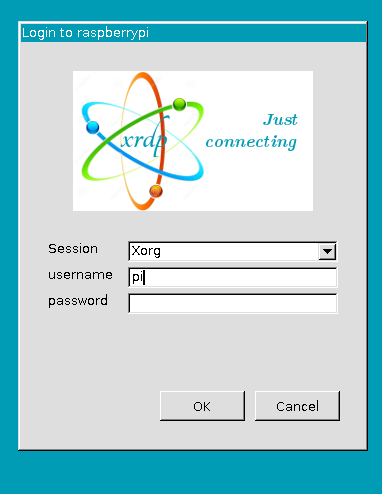
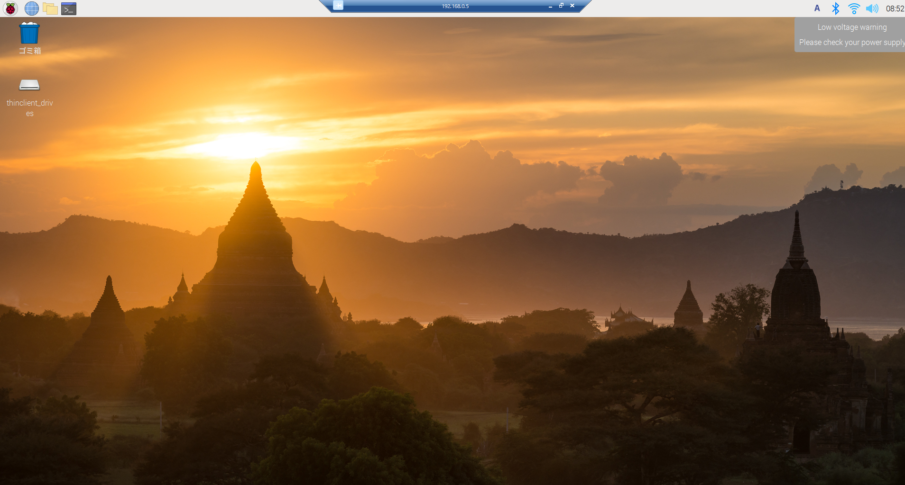

# XRDPインストール（ラズパイ側）
- ラズパイを別PCからリモートデスクトップで入るためにラズパイ本体にXRDPをインストールする
- ラズパイ側のコンソールで以下コマンドを入力
```
sudo apt-get update
sudo apt-get install xrdp
```
- ラズパイを再起動する
- 下記コマンドでxrdpの実行状態を取得
```
sudo systemctl status xrdp
```
- 上から3行目がActive: active(running)となっていればOK

- 下記コマンドを実行
```
sudo raspi-config
```

- ラズパイのConfig画面になるので　2 Display Option > D4 Screen BlankingでWould you like to enable screen blanking?の表示が出たらOKを押す

- ラズパイを再起動する

# ログイン（別PC側）
- リモートデスクトップでラズパイのIPを入力
  - IPはラズパイ側のコンソールで"ifconfig"と入力すると確認可能
- Xrdpのログイン画面が現れる

- ユーザー名とパスワードを入力する
  - 特に設定していなければユーザー名は"pi"のはず
- ログインできた


# Gitのリモートレポジトリから落としてくる
- https://magazine.techacademy.jp/magazine/10274

## GitをTokenでPushする
- https://rfs.jp/server/git/github/personal_access_tokens.html

## エラー対処
- https://qiita.com/kzri4/items/524f24504100eed78bec

# RaspiのGPUをONにする
- https://www.kalium.net/image/2021/03/11/raspi4%E3%81%AEgpu%E3%82%92%E6%9C%89%E5%8A%B9%E3%81%AB%E3%81%99%E3%82%8B/

# VNCでラズパイの映像をPCに転送する
- https://monomonotech.jp/kurage/raspberrypi/vnc.html