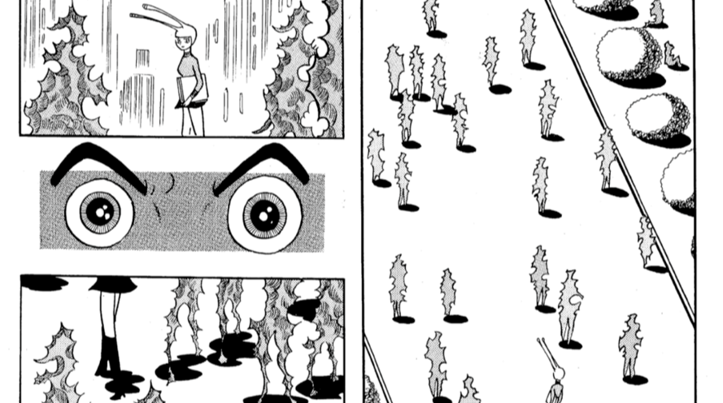

# 【StableDiffusion】リアルタイムで顔を美少女に変換する人類ギャルゲー化デバイスを作った（ソフト編）【OpenCV】

## 背景
5月に美少女ヘッドフォンという作品をKyotoMakerFaire2023に展示した．どんなものかというとヘッドフォンをつけると，リアルタイムに周囲の声が美少女やイケメン，コナンに出てくる犯人風の声に聞こえるというものだった．（マイクから拾った音をPythonでフォルマント変換して声質を変えている→[詳細](https://gakutosasabe.github.io/pages/portfolio/Bishoujo))クオリティ的にはあんまり高くなかったのだが，刺さる人には刺さって楽しんでもらえた．


展示を色んな人に見せている中で「これ，目の前にいるひとも女の子の顔になったら面白いなぁ」という声をいただいた．また，他の方の展示で液晶パネルとArduinoとカメラを使って，周囲のモノの物体認識をするARマスクを作っている人がいた．似たような感じで視界をハックして，周りの人間が美少女に見える＆声も美少女変換したらもうそれは最強じゃん！？というわけで作り始めた．

# 課題 
上記が作り始めた背景なんだけど，じゃあ周りの人間が美少女に見えたら何に役に立つのか？ちょっと考えてみた．人の外観や声質によって，対面コミュニケーションのしづらさが発生する．例えばかわいい女の子相手には緊張してうまく話せないし，年が離れた人がめっちゃ眉間にしわ寄せて接してくると途端に，本音でしゃべれなくなる．言っている内容が的を得ていても．なんかこうしゃべってる内容も外見に引っ張られて頭に入ってこなくなることってありますよね？（逆のギャップもあるかもしれないけど）．しかし，本来なら何を言ってきているか？という情報が大事なのであって，外見はいわばノイズである．だからといっておじさんにもっと優しい顔になってくださいというのは難しい．じゃあどうするか？
　こっちが変わればいいのである！すなわち，私が見える世界を作り変え，おじさんが美少女に見えれば私たちはもっといきやすくなる！さあ世界をギャルゲーに書き換えようぜ！
（参考） 周りが化け物に見えてしまう中，アンドロイドだけが人間に見えるようになってしまった主人公（火の鳥復活編）．私が作りたいものに近い．


# さあ何を作るか
ここまで考えて漠然と作りたいものが見えてきた
【要件】
- 人の顔をリアルタイム認識し，他の顔に置き換えるＡＲグラス！
- スタンドアローンのＡＲグラスがいいのでラズパイで動かないかな～（Unity使いたくない）
- もとから用意された美少女イラストに顔が置き換わるというのだと前作った笑い男システムでできそうだけど，できれば生成AIでその人っぽい美少女に変わるといいなぁ・・・
- 顔の認識はMediapipeを使えばラズパイでも動きそう
- 処理能力に余裕があれば既存の美少女ヘッドフォンを流用して声質変換もしたい
- 下のイラストみたいなイメージ

- プロスペラっぽくしたい（当時水星の魔女がはやってた）


# さあ作るぞ！
## ハードウェア構成

- カメラから受け取った映像をラズパイで処理して7インチの液晶パネルにＡＲ映像として投影する．
- ARグラスにしても光学設計とかできないし，大変そうなので今回はただ液晶を通じて外の世界を見るようにした（ここらへんはメカ編で解説）

# ソフト開発
## コンテキスト図


## DFD0


### モジュール設計図（システム図）

- ラズパイに搭載したカメラから外の映像を取ってきて，Mediapipeで人の顔を認識，顔部分をトリミングする(OpenCV)
- トリミングした顔の画像をWifiでつながったゲーミングノートにWebAPIを通じて送信，美少女画像を生成させ，ラズパイのローカルに保存
  - https://chamekichi.hatenadiary.jp/entry/2023/07/02/164407
- あとは顔と認識部分に生成した美少女画像を重ね合わせてLCDに映像を投影すればなんちゃってＡＲとなる
- 美少女ヘッドフォン部分は完全流用

### ソースコード(python)
```python
#!/usr/bin/env python
# -*- coding: utf-8 -*-
import copy
import argparse
import threading
import queue
import cv2 as cv
import numpy as np
import mediapipe as mp
import webuiapi
import time
from PIL import Image

from utils import CvFpsCalc


# StableDiffusionのimg2imgで画像を生成する
def conv_face2girl(api,prompt,faceimage):
    # 画像を生成する
    # faceimage = Image.open("facetrim.png")
    girlimage = api.img2img(images = [faceimage], prompt=prompt, seed=5555, cfg_scale=6.5, denoising_strength=0.5)
    #cv.imwrite("girlimage.png", girlimage)
    girlimage.image.save("girlimage.png")
        


def get_args():
    parser = argparse.ArgumentParser()
    parser.add_argument("--prompt", type=str, default="Photographic portrait of beautiful women wearing white lace dress, glowing skin, Sony α7, 35mm Lens, f1.8, film grain, golden hour, soft lighting, by Daniel F Gerhartz")
    parser.add_argument("--device", type=int, default=0)
    parser.add_argument("--width", help='cap width', type=int, default=960)
    parser.add_argument("--height", help='cap height', type=int, default=540)

    parser.add_argument("--model_selection", type=int, default=0)
    parser.add_argument("--min_detection_confidence",
                        help='min_detection_confidence',
                        type=float,
                        default=0.7)

    parser.add_argument('--use_brect', action='store_true')

    args = parser.parse_args()

    return args

def main():
    # 引数解析 ###############################################################
    args = get_args()

    cap_device = args.device
    cap_width = args.width
    cap_height = args.height
    prompt = args.prompt

    min_detection_confidence = args.min_detection_confidence

    use_brect = args.use_brect

    # StableDiffusionのAPIのインスタンスを作成 ############################
    api = webuiapi.WebUIApi(host='192.168.1.127', port=7860)
    # カメラ準備　###############################################################
    cap = cv.VideoCapture(cap_device)
    cap.set(cv.CAP_PROP_FRAME_WIDTH, cap_width)
    cap.set(cv.CAP_PROP_FRAME_HEIGHT, cap_height)

    # モデルロード　###############################################################
    mp_face_detection = mp.solutions.face_detection
    face_detection = mp_face_detection.FaceDetection(
        min_detection_confidence=min_detection_confidence,
    )

    # FPS計測モジュール ########################################################
    cvFpsCalc = CvFpsCalc(buffer_len = 10)

    thread = None


    while True:
        # カメラキャプチャ　###############################################################
        ret, image = cap.read()
        if not ret:
            break
        # image = cv.flip(image, 1) #ミラー表示
        overlay_image = copy.deepcopy(image)
        overlay_image = cv.rotate(overlay_image, cv.ROTATE_180)


        # 検出実施　###############################################################
        #image = cv.cvtColor(image, cv.COLOR_RGB)
        results = face_detection.process(overlay_image)

        # 顔位置＆場所検出 ###############################################################
        if results.detections is not None:
            for detection in results.detections:
               # 検出された顔の場所を取得
                image,posX, posY,posCX,posCY,sizeW,sizeH = culculate_face_pos_and_size(overlay_image, detection)
               # 顔の切り抜き画像を取得
                faceimage = trim_face(posX,posY,sizeW,sizeH,overlay_image)
                # thread開始
                if thread is None or not thread.is_alive() : # ThreadがNoneもしくはThreadが動いてなかったら
                    faceimage = Image.open("facetrim.png")
                    print("thread start")
                    thread = threading.Thread(target=conv_face2girl,args = (api,prompt,faceimage))
                    thread.start()
               
               # StableDiffusion返還後画像を重ねる
                overlay_image = overlay_illust(image,posCX,posCY,sizeH)
    
        # キー処理(ESC：終了) #################################################
        key = cv.waitKey(1)
        if key == 27:  # ESC
            break

        # 画面反映 #############################################################
        cv.imshow('MediaPipe Face Detection Demo', overlay_image)
    
    cap.release()
    cv.destroyAllWindows()
    

    
    return

# 顔のx座標,y座標,x中心座標,y中心座標, 幅，高さを抽出　###############################################################
def culculate_face_pos_and_size(image,detection):
    image_width, image_height = image.shape[1], image.shape[0]
    bbox = detection.location_data.relative_bounding_box
    sizeW = int(bbox.width * image_width) # 幅
    sizeH = int(bbox.height * image_height) # 高さ
    posX = int(bbox.xmin * image_width) #X座標
    posY = int(bbox.ymin * image_height) #Y座標
    posCX = int(bbox.xmin * image_width + (sizeW/2)) #X中心座標
    posCY = int(bbox.ymin * image_height + (sizeH/2)) #Y中心座標
    
    cv.putText(image, "posX:" + str(posX) + " posY:" + str(posY) + " sizeW" + str(sizeW) + " sizeH" + str(sizeH),
               (10,30),cv.FONT_HERSHEY_SIMPLEX,1.0,(0,255,0),2,cv.LINE_AA)
    
    return image, posX, posY, posCX,posCY,sizeW,sizeH

# 重ね合わせ画像をresizeして透明化して重ねる
def overlay_illust(bg,posX,posY,sizeH):
    try :
        olimage = cv.imread("girlimage.png",cv.IMREAD_UNCHANGED) 
        resize_ol_image = cv.resize(olimage, dsize=None, fx=sizeH * 0.0023, fy=sizeH * 0.0023)
        resize_ol_image_height = resize_ol_image.shape[0]
        resize_ol_image_width = resize_ol_image.shape[1]
        
        posY = posY  #高さ方向のオフセット

        # カメラ映像に重ね合わせ画像が入りきる場合は重ね合わせ
        if (posY -(resize_ol_image_height/2) > 0) & (posY +(resize_ol_image_height/2) < bg.shape[0]) &  (posX - (resize_ol_image_width/2) > 0) & (posX + (resize_ol_image_width/2) < bg.shape[1]):  
            #bg[int(posY-(resize_ol_image_height/2)):int(posY+(resize_ol_image_height/2)),int(posX-(resize_ol_image_width/2)):int(posX+(resize_ol_image_width/2))] = (bg[int(posY-(resize_ol_image_height/2)):int(posY+(resize_ol_image_height/2)),int(posX-(resize_ol_image_width/2)):int(posX+(resize_ol_image_width/2))] * (1.0 - alpha)).astype('uint8') #透明度がMaxの箇所はBGR値を0に(黒に)
            #bg[int(posY-(resize_ol_image_height/2)):int(posY+(resize_ol_image_height/2)),int(posX-(resize_ol_image_width/2)):int(posX+(resize_ol_image_width/2))] = (bg[int(posY-(resize_ol_image_height/2)):int(posY+(resize_ol_image_height/2)),int(posX-(resize_ol_image_width/2)):int(posX+(resize_ol_image_width/2))] + (laugh_man_color * alpha)).astype('uint8') #合成
            bg[int(posY-(resize_ol_image_height/2)):int(posY+(resize_ol_image_height/2)),int(posX-(resize_ol_image_width/2)):int(posX+(resize_ol_image_width/2))] = resize_ol_image   
        return bg
    except Exception as ex :
        print(ex)
        return bg

# 顔の部分を切り抜き()
def trim_face(posX,posY,sizeW,sizeH,image):
    try :
        faceimage = image[posY:posY+sizeH,posX:posX+sizeW] 
        cv.imwrite("facetrim.png", faceimage)
        return faceimage
    except Exception as ex :
        print(ex)
        return image


if __name__ == '__main__':
    main()


```
- ゲーミングPCにStableDiffusionWebUIをサーバーとして立てておいて，WebAPI経由で画像生成を行うようにした
  - https://chamekichi.hatenadiary.jp/entry/2023/07/02/164407
- しかし，画像生成に2,3秒かかってしまうため，画像生成を待ってるとカメラ映像の更新も止まってしまう問題が発生
- 結果，PythonのThread機能を使用して，別スレッドでひたすらゲーミングPCに対して画像生成要求を投げるようにした．
- ラズパイでは現状，Mediapipeの0.8.6までしか使えないので注意
### できたもの（ゲーミングPCで実行）

<blockquote class="twitter-tweet"><p lang="ja" dir="ltr">人類２次元化計画 <a href="https://t.co/XtZDrXHNjo">pic.twitter.com/XtZDrXHNjo</a></p>&mdash; Gakuto Sasabe (@gakuto66) <a href="https://twitter.com/gakuto66/status/1705571155002978358?ref_src=twsrc%5Etfw">September 23, 2023</a></blockquote> <script async src="https://platform.twitter.com/widgets.js" charset="utf-8"></script>

# メカ開発
## CAD設計
- 3DモデルはFusion360を用いて作成