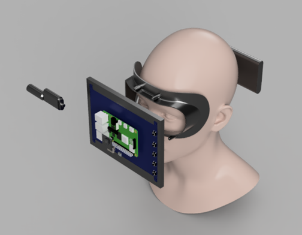

# メカ

# 3Dモデルを手に入れる
- 大正義GrabCAD
    - https://grabcad.com/library?page=1&time=all_time&sort=recent&query=human

# 配線のモデリングの仕方
- https://forums.autodesk.com/t5/fusion-360-ri-ben-yu/keburu-pei-xiannomoderingu/td-p/9504694

# 顔に沿ったマスクをスカルプトで創る
- https://www.youtube.com/watch?v=b9A0U_Dsk9Y

# スカルプトからソリッドモデルにする
- https://www.youtube.com/watch?v=9LqycuRKxmk
# スカルプトモデルマスター
- https://www.youtube.com/watch?v=yR0Yg-28Eb8

- ソリッドモデルから面だけをスカルプトで作るか，スカルプトで作ったモデルをソリッドモデルに変換するか？でいけそう

とりあえずいい感じにソリッドで原型作ってから面だけスカルプトで編集する

- 結局立方体から作った．

- ねじ穴の作り方
  - https://pon-osi.com/fusion360-hole/