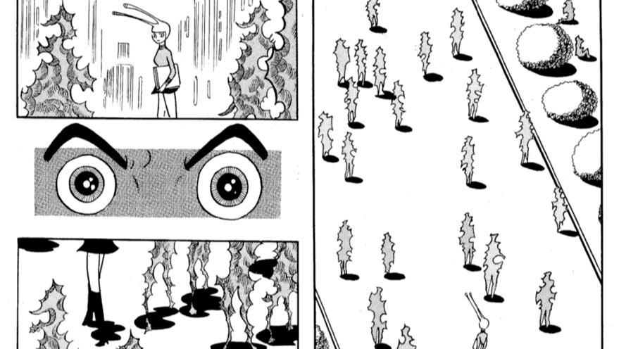
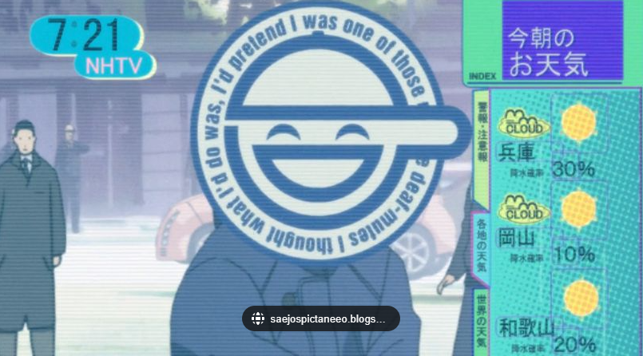
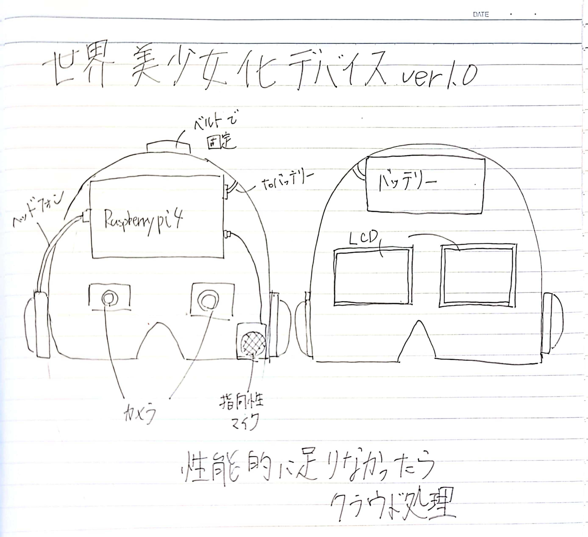
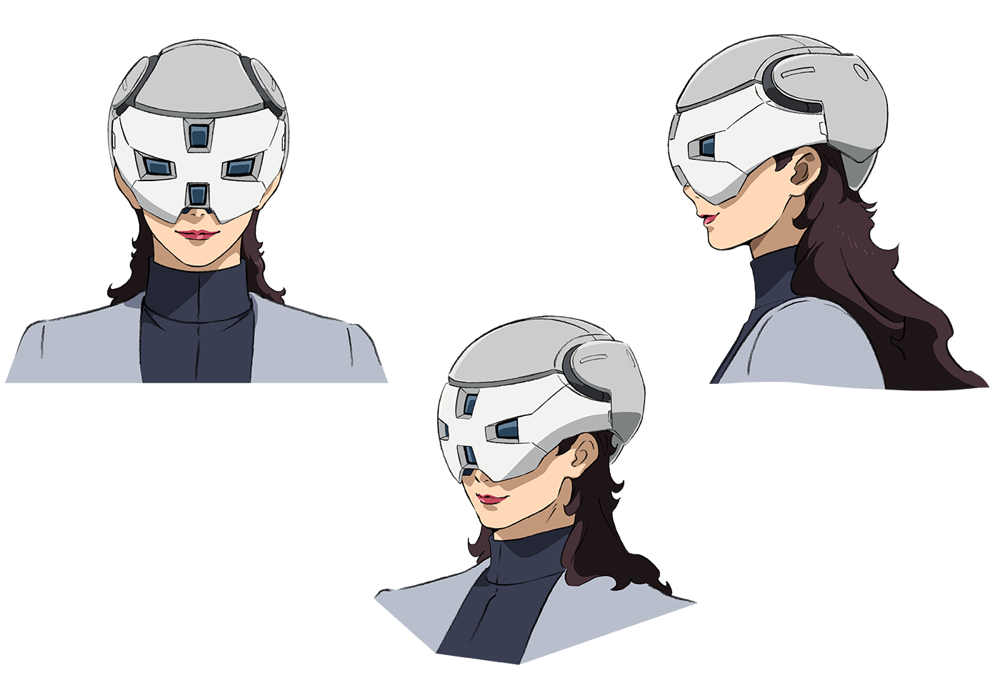

# 計画概要
- 美少女ヘッドフォンをKyotoMakerFaire2023に展示し，ある程度の評価を得たので次のステップへ
- 視界をハックし，周りの人間が美少女に見える＆声を美少女変換する
- これらをひとつの仮面型デバイスに統合し，夢の世界を実現する
# Issue 
- 人の外観や声質によって，対面コミュニケーションのしづらさが発生する
  - ex) かわいい女の子相手には緊張する，偉い人相手には緊張する
- 見える世界を変え，周りの人間の外観の主観的認知を変化させることによってコミュニケーションのしづらさを緩和する
  - フィクションである例)火の鳥復活編，攻殻機動隊SAC
    - 周りが化け物に見えてしまう中，アンドロイドだけが人間に見えるようになってしまった主人公（火の鳥復活編）
    - 
    - 人類の大半が電脳化した近未来で，周りの人間の脳をリアルタイムでハッキングし，周りから見た自分の顔に顔マークを貼り付けるハッカー，通称笑い男(攻殻機動隊SAC)
    - 
# 何を作るか
- 人の顔をリアルタイム認識し，他の顔に置き換え，声質を置き換える自作ARグラス
  - スタンドアローンとするため，Raspberry pi 4 を使用
  - 人の認識にはMediapipeを使う
  - Unityは使わずOpenCVでAR表現を行う
  - スタンドアローンで動くグラス
  - 声質変換は既存の美少女ヘッドフォンを流用
## イメージ

- プロスペラっぽく作りたい
## 構成

# 設計
## ソフト設計
### コンテキスト図

### DFD0

### モジュール設計図
