# 美少女重ね表示部分の開発
- dlibでやってるこの人のがいい感じに使えそう
  - https://rikoubou.hatenablog.com/entry/2019/05/15/172615

- 普通にface_detection.pyを走らせた結果


- 透明色を設定する
  - https://qiita.com/mo256man/items/f7524dd34718a01fb3df
  - https://qiita.com/smatsumt/items/923aefb052f217f2f3c5
    - 透過画像をアルファチャンネル付き画像というらしい


# Mediapipe＋OpenCV＋Pythonで笑い男システム
## 笑い男とは
- 笑い男は攻殻機動隊というアニメ作品に出てくるスーパーハッカー
  - https://dic.pixiv.net/a/%E7%AC%91%E3%81%84%E7%94%B7
- 彼は自分を視認する人間の電脳（機械に置き換えた脳のこと）をリアルタイムでハッキングして，自分の顔を笑い男マークに変えてしまうのだ！
 
- 今回はMediapipe＋OpenCV＋Pythonで，Webカメラに映った人間の顔を笑い男マークに変えるというプログラムを作った
## 作った
### 設計
- モジュール構造図は以下のような感じで，ノートPCのカメラ映像から顔の位置をMediapipeを用いて検出し，OpenCVを用いて笑い男イラストを貼り付けてディスプレイに映像を投影する



### 環境構築
#### Mediapipeのインストール
- 下記HPを参考に実行
  - https://www.cs.k.tsukuba-tech.ac.jp/labo/koba/research/sigaci_ws_in_hi2022/install_mediapipe/

- PyPIによるとMediapipeはpython3.11には対応していないらしいので注意（3.9,3.10は対応）


- PC上に任意のバージョンのPythonをインストールできるpyenvを使ってpython 3.9.11をインストール
  - https://qiita.com/noppe78/items/6de6a11116850a0a81a7

- 下記コマンドでpythonのバージョンを3.9に切り替える
```
pyenv global 3.9.11
```
- 下記コマンドでmediapipeをインストール
```
pip install mediapipe
```

- 最後にmediapipeのサンプルを落としてきて実行
```
$ git clone https://github.com/Kazuhito00/mediapipe-python-sample
$ cd mediapipe-python-sample
$ python3 sample_hand.py
```
#### OpenCVのインストール
- pythonのOpencvを下記コマンドをコマンドプロンプトから入力してインストールする
```
pip install opencv–python"
```
- Pythonの対話型実行環境を実行してOpenCVのライブラリcv2が利用できるかをチェック

- 対話型実行環境が起動されると「>>>」とプロンプトが表示されるので"import cv2"と入力。エラーが出なければinstallできている。

### 実装
#### コード(Python)
```python
#!/usr/bin/env python
# -*- coding: utf-8 -*-
import copy
import argparse

import cv2 as cv
import numpy as np
import mediapipe as mp

def get_args():
    parser = argparse.ArgumentParser()

    parser.add_argument("--device", type=int, default=0)
    parser.add_argument("--width", help='cap width', type=int, default=960)
    parser.add_argument("--height", help='cap height', type=int, default=540)

    parser.add_argument("--model_selection", type=int, default=0)
    parser.add_argument("--min_detection_confidence",
                        help='min_detection_confidence',
                        type=float,
                        default=0.7)

    parser.add_argument('--use_brect', action='store_true')

    args = parser.parse_args()

    return args

def main():
    # 引数解析 ###############################################################
    args = get_args()

    cap_device = args.device
    cap_width = args.width
    cap_height = args.height

    model_selection = args.model_selection
    min_detection_confidence = args.min_detection_confidence

    use_brect = args.use_brect


    # カメラ準備　###############################################################
    cap = cv.VideoCapture(cap_device)
    cap.set(cv.CAP_PROP_FRAME_WIDTH, cap_width)
    cap.set(cv.CAP_PROP_FRAME_HEIGHT, cap_height)

    # モデルロード　###############################################################
    mp_face_detection = mp.solutions.face_detection
    face_detection = mp_face_detection.FaceDetection(
        model_selection=model_selection,
        min_detection_confidence=min_detection_confidence,
    )


    while True:
        # カメラキャプチャ　###############################################################
        ret, image = cap.read()
        if not ret:
            break
        image = cv.flip(image, 1) #ミラー表示
        overlay_image = copy.deepcopy(image)

        # 検出実施　###############################################################
        #image = cv.cvtColor(image, cv.COLOR_RGB)
        results = face_detection.process(image)

        # 顔位置＆場所検出 ###############################################################
        if results.detections is not None:
            for detection in results.detections:
                # 描画
                image,posX,posY,sizeW,sizeH = culculate_face_pos_and_size(image, detection)
                overlay_image = overlay_illust(image,posX,posY,sizeH)
    
        # キー処理(ESC：終了) #################################################
        key = cv.waitKey(1)
        if key == 27:  # ESC
            break

        # 画面反映 #############################################################
        cv.imshow('MediaPipe Face Detection Demo', overlay_image)
    
    cap.release()
    cv.destroyAllWindows()
    
    
    
    return

# 顔のx座標,y座標,幅，高さを抽出　###############################################################
def culculate_face_pos_and_size(image,detection):
    image_width, image_height = image.shape[1], image.shape[0]
    bbox = detection.location_data.relative_bounding_box
    sizeW = int(bbox.width * image_width)
    sizeH = int(bbox.height * image_height)
    posX = int(bbox.xmin * image_width + (sizeW/2))
    posY = int(bbox.ymin * image_height + (sizeH/2))
    
    cv.putText(image, "posX:" + str(posX) + " posY:" + str(posY) + " sizeW" + str(sizeW) + " sizeH" + str(sizeH),
               (10,30),cv.FONT_HERSHEY_SIMPLEX,1.0,(0,255,0),2,cv.LINE_AA)
    
    return image, posX,posY,sizeW,sizeH

# 笑い男画像をresizeして透明化して重ねる
def overlay_illust(bg,posX,posY,sizeH):
    laugh_man = cv.imread("C:\\Users\\user\\Desktop\\HearExpansion\\HumanGalgeeSystem\\Development\\HumanGalgeeSystem\\warai_flat.png",cv.IMREAD_UNCHANGED)  # アルファチャンネル込みで読み込む)
    resize_laugh_man = cv.resize(laugh_man, dsize=None, fx=0.4, fy=0.4)
    resize_laugh_man_height = resize_laugh_man.shape[0]
    resize_laugh_man_width = resize_laugh_man.shape[1]

    #笑い男画像のアルファチャンネルだけ抜き出す(0~255の値が入っている)
    alpha = resize_laugh_man[:,:,3]
    alpha = cv.cvtColor(alpha, cv.COLOR_GRAY2BGR) # grayをBGRに変換(各ピクセルのα値を各チャンネル(B,G,Rにコピー))
    alpha = alpha /255.0 #0.0 ~ 1.0の間に変換
    
    laugh_man_color = resize_laugh_man[:,:,:3] #色情報のみを抜き出す

    # カメラ映像に笑い男画像が入りきる場合は重ね合わせ
    if (posY -(resize_laugh_man_height/2) > 0) & (posY +(resize_laugh_man_height/2) < bg.shape[0]) &  (posX - (resize_laugh_man_width/2) > 0) & (posX + (resize_laugh_man_width/2) < bg.shape[1]):  
        bg[int(posY-(resize_laugh_man_height/2)):int(posY+(resize_laugh_man_height/2)),int(posX-(resize_laugh_man_width/2)):int(posX+(resize_laugh_man_width/2))] = (bg[int(posY-(resize_laugh_man_height/2)):int(posY+(resize_laugh_man_height/2)),int(posX-(resize_laugh_man_width/2)):int(posX+(resize_laugh_man_width/2))] * (1.0 - alpha)).astype('uint8') #透明度がMaxの箇所はBGR値を0に(黒に)
        bg[int(posY-(resize_laugh_man_height/2)):int(posY+(resize_laugh_man_height/2)),int(posX-(resize_laugh_man_width/2)):int(posX+(resize_laugh_man_width/2))] = (bg[int(posY-(resize_laugh_man_height/2)):int(posY+(resize_laugh_man_height/2)),int(posX-(resize_laugh_man_width/2)):int(posX+(resize_laugh_man_width/2))] + (laugh_man_color * alpha)).astype('uint8') #合成

    return bg


if __name__ == '__main__':
    main()
```

#### コードの説明(ChatGPT)
- このコードの説明は以下

```
このコードは、カメラからの映像に対してリアルタイムで顔検出を行い、検出された顔に笑い男の画像を重ねるPythonスクリプトです。
コードの主な手順は次のとおりです。
1. 必要なライブラリをインポートします。
2. コマンドライン引数を解析するためにargparseを使用するget_args()関数が定義されます。
3. メインの処理を行うmain()関数が定義されます。
4. カメラを初期化し、キャプチャの幅と高さを設定します。
5. MediaPipeライブラリを使用して顔検出モデルをロードします。
6. メインのループでカメラからフレームをキャプチャし、イメージを反転（ミラー表示）させます。
7. MediaPipeを使用して顔検出を実行し、検出結果を取得します。
8. 検出された顔があれば、各顔の位置とサイズを計算し、イメージに描画します。
9. キーボード入力を監視し、ESCキーが押された場合にループを終了します。
10. 最後にカメラを解放し、ウィンドウを閉じます。

特に顔の位置とサイズの計算、および笑い男の画像の重ね合わせは、culculate_face_pos_and_size()関数とoverlay_illust()関数で行われます。
```
#### 詰まったところ
- overlay_illust()関数の中で笑い男の画像の重ね合わせをしているのだが，そのまま重ねると笑い男画像の背景が黒くなってしまう
- この笑い男画像は透過pngであり，RGBの値以外にアルファチャンネルという各ピクセルの透明度を表すデータが入っている(0~255)
- 背景と透過pngを合成する場合はこのアルファチャンネルを考慮して合成する必要がある

- まず笑い男画像の各ピクセルのアルファチャンネルだけを抜き出し，それをBGRの形式で展開する
- 次に各ピクセルのアルファチャンネルの値(0~255)を0~1.0の値に正規化する
- 最後に，笑い男画像から各ピクセルのRGB情報だけを抜き出し，画像合成の準備は完了
```python
# 笑い男画像をresizeして透明化して重ねる
def overlay_illust(bg,posX,posY,sizeH):
    laugh_man = cv.imread("C:\\Users\\user\\Desktop\\HearExpansion\\HumanGalgeeSystem\\Development\\HumanGalgeeSystem\\warai_flat.png",cv.IMREAD_UNCHANGED)  # アルファチャンネル込みで読み込む)
    resize_laugh_man = cv.resize(laugh_man, dsize=None, fx=0.4, fy=0.4)
    resize_laugh_man_height = resize_laugh_man.shape[0]
    resize_laugh_man_width = resize_laugh_man.shape[1]

    #笑い男画像のアルファチャンネルだけ抜き出す(0~255の値が入っている)
    alpha = resize_laugh_man[:,:,3]
    alpha = cv.cvtColor(alpha, cv.COLOR_GRAY2BGR) # BGRに変換(各ピクセルのα値を各チャンネル(B,G,Rにコピー))
    alpha = alpha /255.0 #0.0 ~ 1.0の間に変換
    laugh_man_color = resize_laugh_man[:,:,:3] #色情報のみを抜き出す
```
- 背景画像の笑い男画像が重なるピクセルのRGB値をアルファ値によって変化させる（完全に透過の部分は黒(RGB値：[0,0,0])
- 最後にアルファ値の割合で笑い男画像を背景画像に合成する
```python    
    # カメラ映像に笑い男画像が入りきる場合は重ね合わせ
    if (posY -(resize_laugh_man_height/2) > 0) & (posY +(resize_laugh_man_height/2) < bg.shape[0]) &  (posX - (resize_laugh_man_width/2) > 0) & (posX + (resize_laugh_man_width/2) < bg.shape[1]):  
        bg[int(posY-(resize_laugh_man_height/2)):int(posY+(resize_laugh_man_height/2)),int(posX-(resize_laugh_man_width/2)):int(posX+(resize_laugh_man_width/2))] = (bg[int(posY-(resize_laugh_man_height/2)):int(posY+(resize_laugh_man_height/2)),int(posX-(resize_laugh_man_width/2)):int(posX+(resize_laugh_man_width/2))] * (1.0 - alpha)).astype('uint8') #透明度がMaxの箇所はBGR値を0に(黒に)
        bg[int(posY-(resize_laugh_man_height/2)):int(posY+(resize_laugh_man_height/2)),int(posX-(resize_laugh_man_width/2)):int(posX+(resize_laugh_man_width/2))] = (bg[int(posY-(resize_laugh_man_height/2)):int(posY+(resize_laugh_man_height/2)),int(posX-(resize_laugh_man_width/2)):int(posX+(resize_laugh_man_width/2))] + (laugh_man_color * alpha)).astype('uint8') #合成

    return bg
```
### 成果物
- さすがMediapipe！検知精度がたけぇぇ～．マスクして眼鏡かけてもゴリゴリに検知してくれるぜ！！！
###　まとめ
- mediapipeに顔を検知し，笑い男の透過pngを合成することができた
### 参考にさせていただいた記事
- dlibでやってる方
  - https://rikoubou.hatenablog.com/entry/2019/05/15/172615
- アルファチャネルつき画像をOpenCVで扱う
  - https://qiita.com/mo256man/items/f7524dd34718a01fb3df
  - https://qiita.com/smatsumt/items/923aefb052f217f2f3c5