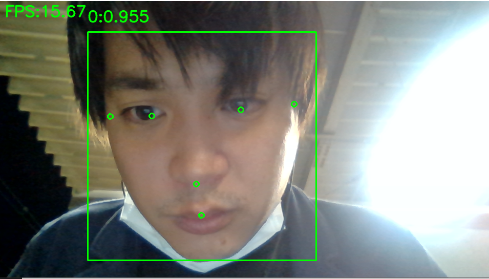
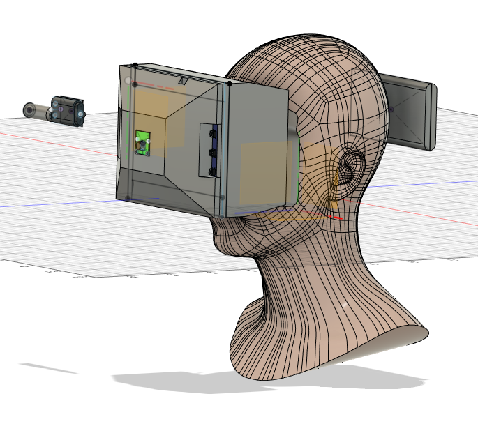

# 美少女重ね表示部分の開発
- dlibでやってるこの人のがいい感じに使えそう
  - https://rikoubou.hatenablog.com/entry/2019/05/15/172615

- 普通にface_detection.pyを走らせた結果

- 透明色を設定する
  - https://qiita.com/mo256man/items/f7524dd34718a01fb3df
  - https://qiita.com/smatsumt/items/923aefb052f217f2f3c5
    - 透過画像をアルファチャンネル付き画像というらしい

# Mediapipe＋OpenCV＋Pythonで笑い男システム
## 概要
- Raspberrypiで動くオリジナルARヘッドセットシステム（↓こんなん）を作っているのだが，それの体験コンテンツとして笑い男なりきりシステムを作る

- 笑い男ってなんや？って人はこちら
  - https://dic.pixiv.net/a/%E7%AC%91%E3%81%84%E7%94%B7

