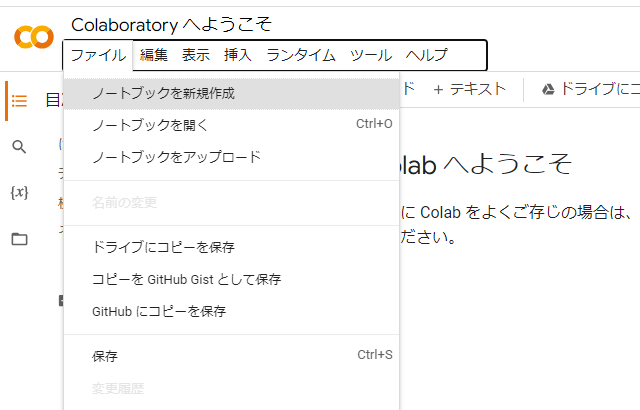
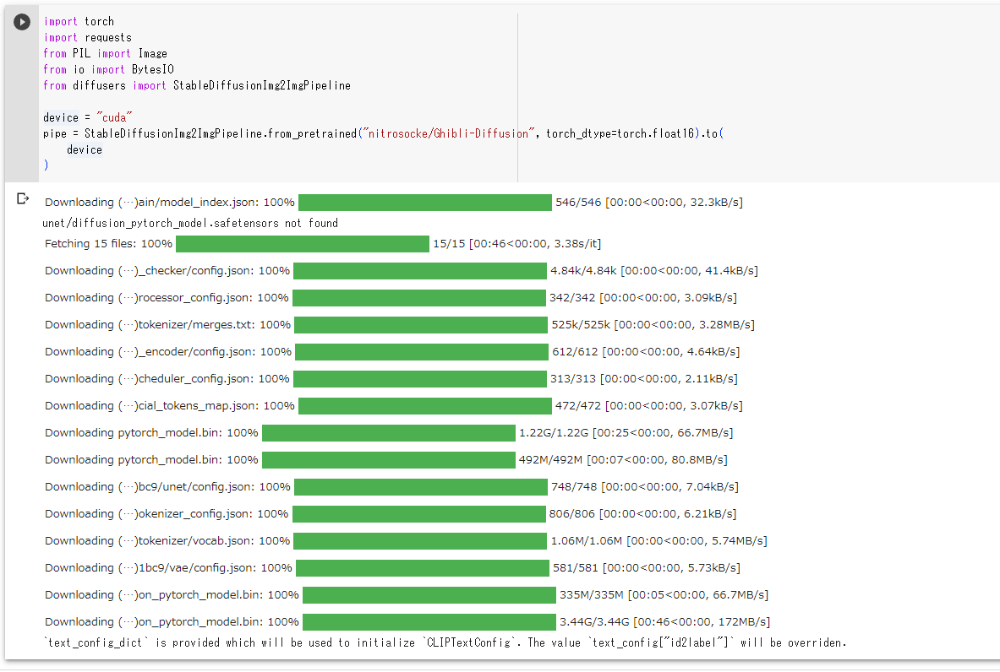
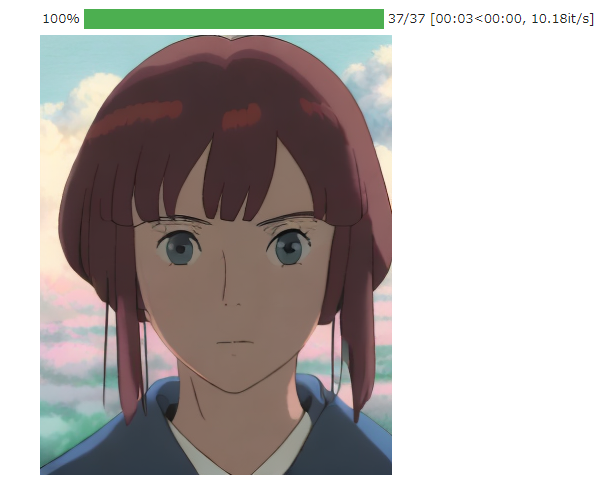

# 顔二次元化部分の開発・調査
## 調査
- そもそもAPI叩いて画像to画像で変換できんのか？
  - Image2Imageで検索するとそこそこ引っかかる
    - https://touch-sp.hatenablog.com/entry/2023/01/04/192356
    - StableDiffusionImg2ImgPipelineというのでできる？
    - Stable Diffusion img2imgというやつらしい
- Stable Diffusion img2imgが有力か？
  - ローカルで動かした例
    - https://kuina.games/1211/
- Stable Disffusion img2imgをGoogleColaboで動かして，ローカルのPythonと通信するとかできるんかな？なんかできそう
  - GoogleColaboでStableDiffusionのimg2img
    - https://ysko909.github.io/posts/execute-stable-diffusion-on-google-colaboratory/
- Diffusersというのを使うとローカルに構築できるっぽい

### 結論：ラズパイのPythonからGoogle ColaboでStable Diffusionに画像を何らかの方法で送り，img2imgで画像生成したのちに，ラズパイにもう一度送付し，Resizeしたのちに重ねる

### 疑問：背景どうやって切り取るかな・・・
- 予め背景を白の二次元キャラクターみたいな感じで指示出しておけば，あとでOpenCVで白部分だけ透過とかはできそう
  - https://www.yutaka-note.com/entry/opencv_01


### Google ColaboでStableDiffusionのimg2imgを使う
#### Google Colaboratoryへ
- 右上からノートブックを新規作成

- Stable diffusionを実行するためにGPUを有効にする必要がある
  - 編集 > ノートブックの設定 > ハードウェアアクセラレータをGPUにする

#### Stable Diffusionのインストールを行う
- notebookに下記コマンドを入力し，diffusersをインストールする
```
!pip install diffusers transformers ftfy accelerate
```
#### Stable Diffusionの初期設定を行う

- 下記コードを入力して実行
```
import torch
import requests
from PIL import Image
from io import BytesIO
from diffusers import StableDiffusionImg2ImgPipeline

device = "cuda"
pipe = StableDiffusionImg2ImgPipeline.from_pretrained("nitrosocke/Ghibli-Diffusion", torch_dtype=torch.float16).to(
    device
)
```
- 今回は画像をジブリ風画像に変換してくれるGhibli-Diffusionを使ってみた

- 以下のような表示が出たらOK


#### 変換したい画像をGoogleColaboratoryにアップロードする
- GoogleColaboratoryのサイドパネルにドラッグアンドドロップで画像を配置する

- 今回はtestimage3という画像を使った(31歳男性)


#### 画像を生成する
- 下記コードを入力して実行
```python
init_image = Image.open("testimage3.PNG").convert("RGB") #ファイル名をアップロードした画像の名前に変える
init_image.thumbnail((768, 768))
prompt = "Ghibli style beautiful girl with white background"
generator = torch.Generator(device=device).manual_seed(1024)
image = pipe(prompt=prompt, image=init_image, strength=0.75, guidance_scale=7.5, generator=generator).images[0]
image
```
#### 画像が表示される


#### 参考
- https://huggingface.co/docs/diffusers/using-diffusers/img2img
