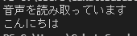
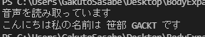

# Projectの目的
- 身体拡張テーマということで、耳の身体拡張の可能性を探る
# 問い
- 耳機能を制限したり拡張したり、変換をかけたりしたら、人間はどういう感情になるのか？どういう思考が誘発されるのか？
# 具体的にやりたいこと
1. 具体的には音声の文字起こしとその文字を活用した耳機能拡張（あるワードを聞こえないようにする、あるワードが聞こえたら、聞こえる音をおおきくする等、文字起こした内容を要約して、視界に投影する等）
2. 聞こえる音を加工することによって、音の認識能力事態に変化を与える（リアルタイムで聞こえる音が恋声になるとか、目の前の人から発された声がイケボになるとか）
# 実装タスク
- Pythonの環境を整える（関連のライブラリなど,pip）- ぶちょー
    - Python
        - <参考にしたサイト> https://www.python.jp/install/windows/install.html
        - インストールver. python-3.9.1-amd64.exe
        - Add Python 3.x to PATH を忘れないこと
    - pip → 3.9.1にすでに入っているのでインストール不要
- Pythonでマイクからの音声を取り込む - SSB(完了)
- Speech Recognitionを使って文字起こししてみる - SSB(完了)
    - https://self-development.info/python%E3%81%A7%E9%9F%B3%E5%A3%B0%E3%81%8B%E3%82%89%E3%83%86%E3%82%AD%E3%82%B9%E3%83%88%E3%81%B8%E5%A4%89%E6%8F%9B%E3%80%90speechrecognition%E3%80%91/
- 文字起こしの結果から、音声のフィードバックの仕方を変化させてみる
- 音の加工、ピッチの変更とかのライブラリを探る
- 音の加工やピッチの変更を実際に行ってみる。

# 開発メモ
## Speech Recognitionを使って文字起こしをする
### 実行環境
- Python 3.9
### SpeechRecognitionとPyaudioのinstall
- SpeechRecognitionをpip経由でインストールする
```
pip install SpeechRecognition
```
### WindowsのPyaudioインストール
- Python3.7~3.9だとPyaudioがpip経由でインストールできない。非公式版だが、下記URLからPython 3.9用 Pyaudio(PyAudio‑0.2.11‑cp39‑cp39‑win_amd64.whl)をダウンロードする
    - https://www.lfd.uci.edu/~gohlke/pythonlibs/#pyaudio
- whlファイルがあるディレクトリでpip経由でインストールする
```
py -m pip install PyAudio-0.2.11-cp39-cp39-win_amd64.whl
```
### linuxのPyaudioインストール
- portaudioというライブラリに依存しておりそのままだとpip経由でpyAudioインストールしようとするとエラーを吐くため
```
sudo apt-get install portaudio19-dev
```
でportaudioをインストールしてから
```
pip install pyaudio
```
でOK
### 実装したコード
```
import speech_recognition as sr
import pyaudio

if __name__ == "__main__": #importされた場合に実行しないようにするらしい
    r = sr.Recognizer()
    with sr.Microphone() as source: # pyaudioを使ってマイクを認識？
        r.adjust_for_ambient_noise(source)
        print("音声を読み取っています")
        audio = r.listen(source)
        try:
            query = r.recognize_google(audio, language='ja-JP')
            print(query)
        except:
            print("エラー")

```
### 実行結果
- こんにちはといった場合<br>
  
- こんにちは私の名前は佐々部岳人ですといった場合
 
### まとめ
- そこそこの精度は出る。
- マイク入力の終わりを指定してないけど、何故か音声の終わりは検知している
### 参考資料
- Pythonでマイクを用いた音声認識を行う
    - https://heartstat.net/2021/05/27/python_speech_recognition/
    - http://xn--u9j207iixgbigp2p.xn--tckwe/archives/10584

## 文字起こしの結果から、音声のフィードバックの仕方を変化させてみる
### 要求
- 検閲させるキーワードを設定する
- 文字起こしの内容から検閲ワードを見つける
- 検閲ワードを見つけたらマイクから得た音声に何かしらの加工をかけて（まずは簡単にP音を１０秒流す）検閲ワードをユーザーに聞かせないようにする
### 詳細タスク
- 検閲ワードをユーザーに入力させる
- 最新の文字起こししたセンテンスに検閲ワードが含まれていないか検索する
- 検閲ワードが含まれていた場合は、P音を流して、マイクからの音をユーザーにフィードバックする
- 文字起こししたセンテンスを配列に保存する

## Pyaudioを使ってマイクから入力した音声をそのままスピーカーに流す
- Pyaudioを使えばマイクからの音の入力を並列処理できるということらしい。常にマイクから音を取り続けていることが必要なので、スレッドを作ってそちらで常に処理を行っておく必要があるがPyaudioのノンブロッキングモードを使えば勝手にPyaudioでThreadを作ってくれて実行してくれるようだ。
- なのでStreamがOpenしている（音をマイクから収集してスピーカーに流している間）間に音声認識なり、音調変換なりを行えば良さそう

### 実装コード
```
# coding: UTF-8
import speech_recognition as sr
import pyaudio
import time

class AudioFilter():
    def __init__(self):# classの初期設定
        self.p = pyaudio.PyAudio()
        self.channels = 2 #マイクがモノラルの場合は1
        self.rate = 48000 #DVDレベルなので重かったら16000
        self.format = pyaudio.paInt16
        self.stream = self.p.open(
            format = self.format,
            channels = self.channels,
            rate = self.rate,
            output = True,
            input = True,
            stream_callback=self.callback)#音声が流れてきた時に叩くCallBack関数を指定する


#  format  : ストリームを読み書きするときのデータ型
#  channels: ステレオかモノラルかの選択 1でモノラル 2でステレオ
#  rate    : サンプル周波数
#  output  : 出力モード
    
    # コールバック関数（再生が必要なときに呼び出される）
    def callback(self, in_data, frame_count, time_info, status):
        out_data = in_data
        return (out_data, pyaudio.paContinue)
    # 音声取り込みをやめるとき
    def close(self):
        self.p.terminate() 

if __name__ == "__main__": #importされた場合に実行しないようにするらしい
    #AudioFileterのインスタンスを作る
    af = AudioFilter()
    #ストリーミングを始める
    af.stream.start_stream()

    # ノンブロッキングなのでこの中で音声認識・音の変換などを行う
    while af.stream.is_active():
        print("なんの処理をしてもOK")
        #r = sr.Recognizer()
        #with sr.Microphone() as source: # pyaudioを使ってマイクを認識？
        #    r.adjust_for_ambient_noise(source)
        #    print("音声を読み取っています")
        #    audio = r.listen(source)
        #    try:
        #        query = r.recognize_google(audio, language='ja-JP')
        #        print(query)
        #    except:
        #        print("エラー")
    # ストリーミングを止める
    af.stream.stop_stream()
    af.stream.close()
    af.close()
```
### 結果
- 若干実際の音声に対して遅れて出力されるが、音質的には問題なさそう
### 参考資料 
- PyAudioを用いてマイクの入力をそのまま出力する
    - https://ensekitt.hatenablog.com/entry/2018/09/07/200000
    - https://takeshid.hatenadiary.jp/entry/2016/01/10/153503
## PyAudioを使ってマイクから拾った音に対して加工をかけてからスピーカーに流す


