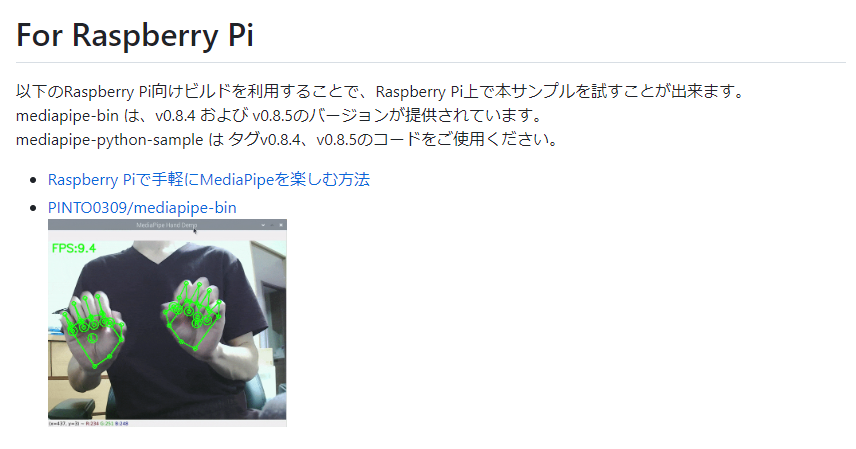

# ラズパイでMediapipeを動作させる
## ラズパイの環境設定
- https://zenn.dev/karaage0703/articles/63fed2a261096d
- Raspberry pi Imagerを使ってSDカードにRaspberry pi OS(64bit版)をインストールする
- 下記コマンドで日本語入力を設定
```
sudo apt update
sudo apt install ibus-mozc

```
## Mediapipeのインストール
- 下記コマンドをターミナルで実行
```
$ sudo apt update && \
  sudo apt install -y python3-dev protobuf-compiler python3-pip git make libssl-dev
$ sudo pip3 install pip --upgrade
$ cd && git clone https://github.com/PINTO0309/mediapipe-bin && cd mediapipe-bin
$ ./v0.8.4/download.sh
$ sudo pip3 install *.whl
$ sudo pip3 install opencv-python
```

- なんかうまくいかない．最新のバージョンにしないといけないのかも

- と思ったら動かそうとしてるsampleがver0.8.8以降だったわ・・・うんち
    -　https://github.com/Kazuhito00/mediapipe-python-sample
