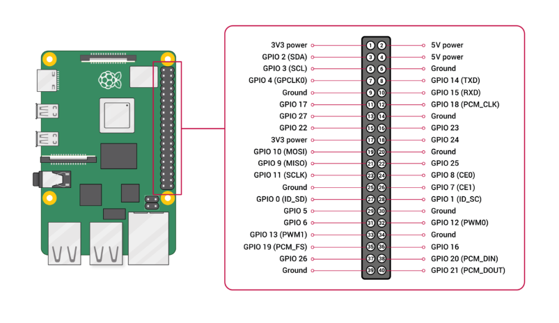
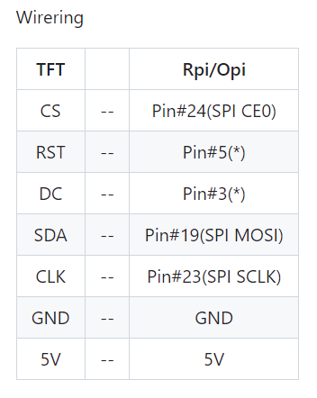

# ili9225にデスクトップを表示する
## ラズパイのIO


## ILI9225のピン配置


## ラズベリーパイのSPI通信を利用可能にする

## ソフト設定
- これを基にソフト設定してみる
    - https://wasa-labo.com/wp/?p=1021
- 下記コマンドでカーネルヘッダーズをインストール
```
sudo apt install build-essential raspberrypi-kernel-headers
```
- とりあえず以下を入力する
```
$ cd /lib/modules/$(uname -r)/kernel/drivers/video/
$ sudo -s
# git clone https://github.com/miyo/fbtft.git
# cd fbtft
# git checkout for_linx_5.10.17
```

## flexfb.cのバグを修正する
- ili9225を使うにはflexfb.cのバグを修正しなければならないらしい
    - https://app.bountysource.com/issues/92222688-fix-a-bug-when-using-ili9225
- flexfb.cの下記部分をnanoで開いて治す
```
        } else if (!strcmp(chip, "ili9225")) {
            if (!width)
                width = 176;
            if (!height)
                height = 220;
            setaddrwin = 0; //このsetaddrwinを1にする
            regwidth = 16;
            if (init_num == 0) {
                initp = ili9225_init;
                initp_num = ARRAY_SIZE(ili9225_init);
            }
```

## makeする
```
# make
# makeinstall
# depmod
```
## ドライバをインストールする
-　下記コマンドでドライバーをロードする
    - https://crimier.wordpress.com/2019/12/03/ili9225-and-fbtft/
```
sudo modprobe flexfb width=220 height=176 regwidth=8 init=-1,0x01,0x01,0x1C,-1,0x02,0x01,0x00,-1,0x03,0x10,0x30,-1,0x08,0x08,0x08,-1,0x0C,0x00,0x00,-1,0x0F,0x08,0x01,-1,0x20,0x00,0x00,-1,0x21,0x00,0x00,-2,50,-1,0x10,0x0A,0x00,-1,0x11,0x10,0x38,-2,50,-1,0x12,0x11,0x21,-1,0x13,0x00,0x66,-1,0x14,0x5F,0x60,-1,0x30,0x00,0x00,-1,0x31,0x00,0xDB,-1,0x32,0x00,0x00,-1,0x33,0x00,0x00,-1,0x34,0x00,0xDB,-1,0x35,0x00,0x00,-1,0x36,0x00,0xAF,-1,0x37,0x00,0x00,-1,0x38,0x00,0xDB,-1,0x39,0x00,0x00,-1,0x50,0x04,0x00,-1,0x51,0x06,0x0B,-1,0x52,0x0C,0x0A,-1,0x53,0x01,0x05,-1,0x54,0x0A,0x0C,-1,0x55,0x0B,0x06,-1,0x56,0x00,0x04,-1,0x57,0x05,0x01,-1,0x58,0x0E,0x00,-1,0x59,0x00,0x0E,-2,50,-1,0x07,0x10,0x17,-3 buswidth=8 setaddrwin=1
```
↑全部で一行

- 続いて以下を入力する
```
sudo modprobe fbtft_device debug=3 name=flexfb rotate=1 speed=16000000 regwidth=8 buswidth=8 gpios=reset:25,dc:24,led:18,cs:8
```

- 続いて以下を入力
```
 con2fbmap 1 1
```

-dmesgを見るとうまく行ってないな・・・

- うまくいかんなぁとりあえず7inchディスプレイで設計して今後の課題とします。
    