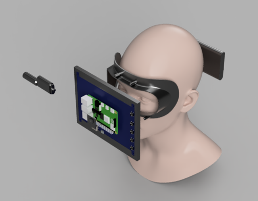
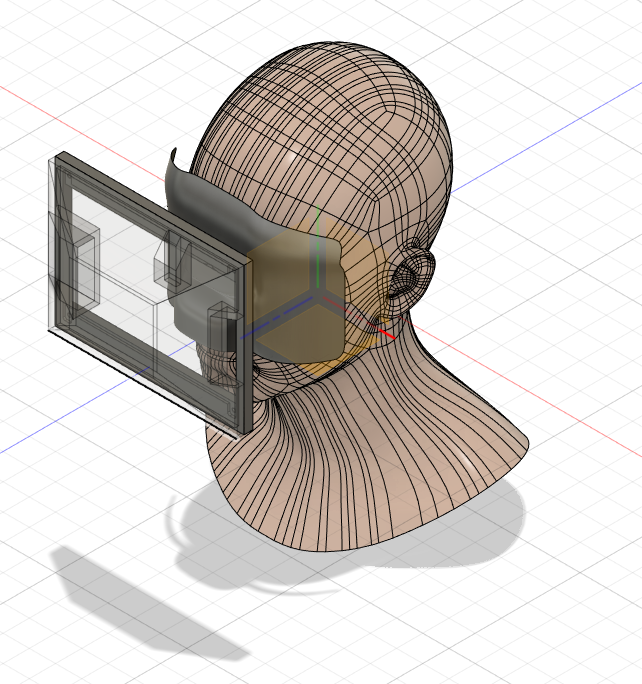

# メカ

# 3Dモデルを手に入れる
- 大正義GrabCAD
    - https://grabcad.com/library?page=1&time=all_time&sort=recent&query=human

# 配線のモデリングの仕方
- https://forums.autodesk.com/t5/fusion-360-ri-ben-yu/keburu-pei-xiannomoderingu/td-p/9504694

# 顔に沿ったマスクをスカルプトで創る
- https://www.youtube.com/watch?v=b9A0U_Dsk9Y

よくわからん
  