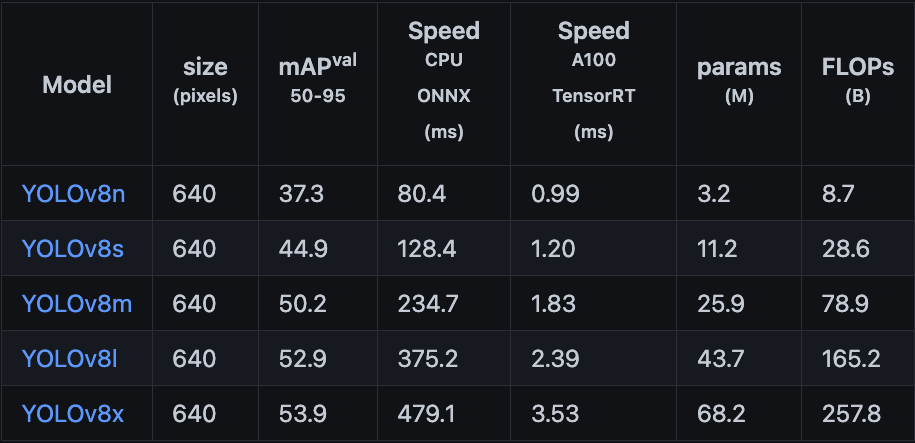
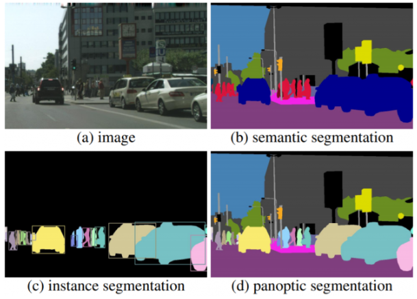

# Yolo V8の導入

- 下記コマンドでインストール
```
pip install ultralytics
```

- 以下のプログラムを実行
```python

from ultralytics import YOLO

# モデルを選択
#model = YOLO("yolov8n.pt")
#model = YOLO("yolov8x.pt")
model = YOLO("yolov8n-seg.pt")

# WEBカメラからリアルタイム検出
results = model(0, show=True)
for i in enumerate(results):
    print(i)


```

- Yoloで使えるモデルは以下の通り
https://tech.revcomm.co.jp/yolov8-introduction

- モデルの精度と速さはこんな感じ


# OpenCVを使ってYoloを使う

# そもそもセグメンテーションとは

- セマンティックセグメンテーション
  - 画像中のすべての画素に対してクラスラベルを予測することを目的とする
- インスタンスセグメンテーション
  - 画像中の全ての物体に対してクラスラベルを予測し，一意のＩＤを付与する
  - 重なりのあるある物体を別々に検出する，空や道路などの定まった形を持たない物体はクラスラベルの予測を行わない点でセマンティックセグメンテーションとは異なる
    - Yoloはインスタンスセグメンテーション？
- パノプティックセグメンテーション
  - 上記２つのセグメンテーションを組み合わせたタスク
  - 画像中のすべての画素に対して，クラスラベルを予測し，一意のＩＤを付与することを目的とする


- https://www.skillupai.com/blog/tech/segmentation1/


# 参考
- 公式HP
  - https://docs.ultralytics.com/tasks/segment/
- PythonでRaspberry piで撮影したカメラ映像をリアルタイム転送する
  - https://qiita.com/Yurix/items/e3260da3d91451c5a60a
