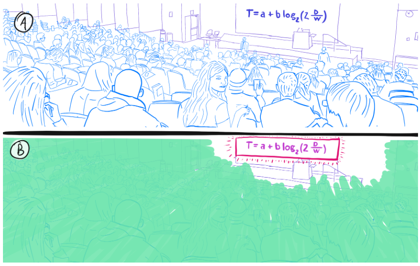

# 背景
- 私みたいにADHDの人間は、なかなか目の前のことに集中できない問題がある
- 現代世界は，認知科学の知見を応用したテクノロジーを悪用し，ビックテックが注意力の奪い合いの戦争を行っているというべき状態になっている
- このようなテクノロジーに幼少期から触れることによってADHD的気質を持った人間が増加している
- よって，現代社会で自らの認知資源を如何に自分に取り戻すかは非常に重要である
- 一方で，Augmented RealityやVirtual Realityを用いて，視覚や聴覚を拡張する試みが行われている
- 特にDiminished Reality技術においては，既に現実世界にある情報を覆い隠すもしくは認知から消失させることが可能となっている
- これらDiminished Realityの技術を使うことにより雑多な情報から自らを守り，生産性を上げることが可能かもしれない

# 何を作るか
- 視覚へのアプローチとして，近年の物体認識技術を用いて集中を阻害する視覚情報を現実世界から覆い隠す機能を開発する
- 一方，聴覚へのアプローチとして，近年のビームフォーミング技術を用いて，集中を阻害する聴覚情報を聴覚から覆い隠す機能を開発する
- 上記二つを組み合わせた”集中力取り戻しシステム”を開発する

# イメージ
## 視界制限のイメージ

## 聴覚制限のイメージ
-　上記で言えば先生の声だけが切り離されて耳に届くようなイメージ

## デバイスのイメージ
- 人類ギャルゲー化デバイスを流用

# 集中力取り戻しシステムの概要
## コンテキスト図

## DFD0
- 方針はラズパイからカメラ映像をゲーミングPCにストリーミングして，ゲーミングPC側で画像解析した後，マスク情報等をラズパイ側に送信，最終的な画像の合成はラズパイ側で行う

